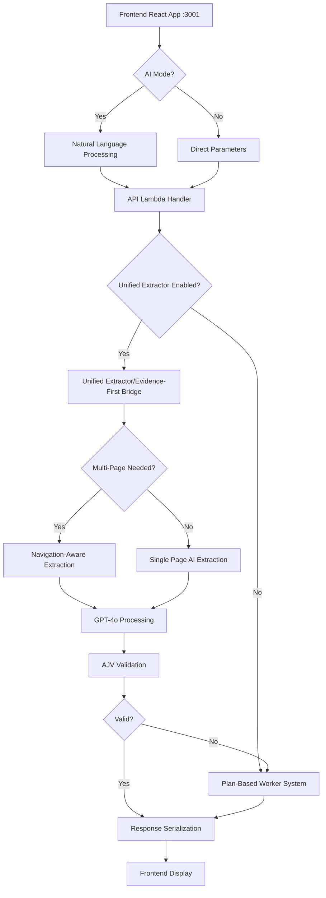

# Atlas Codex Platform: Complete End-to-End Flow Documentation

## Executive Summary
Atlas Codex is a sophisticated web extraction platform that processes user requests through a multi-layered architecture featuring AI-powered extraction, fallback mechanisms, and real-time result delivery. The system uses GPT-4o (not GPT-5) for intelligent data extraction with strict schema validation.

## System Architecture Overview



## Core Components and File Locations

1. **Frontend**: `packages/frontend/src/App.tsx`
2. **API Gateway**: `api/lambda.js`
3. **Unified Extractor**: `api/evidence-first-bridge.js`
4. **Plan-Based System**: `api/worker-enhanced.js`
5. **AI Processing**: `api/ai-processor.js` & `api/atlas-generator-integration.js`

## Detailed Flow Breakdown

### Stage 1: Frontend User Interaction (App.tsx)

**Entry Point**: User accesses `http://localhost:3001`

1. **User Input Collection** (lines 215-487):
   - URL input field
   - AI Mode toggle (enables natural language)
   - Mode selection: scrape/search/map/crawl
   - Unified Extractor toggle (experimental feature)

2. **AI Mode Processing** (lines 221-270):
   ```javascript
   if (aiMode) {
     // Natural language prompt → structured parameters
     const response = await fetch(`${API_BASE}/api/ai/process`, {
       method: 'POST',
       body: JSON.stringify({
         prompt: prompt,
         autoExecute: true
       })
     });
   }
   ```

3. **Direct Extraction Request** (lines 374-436):
   ```javascript
   const requestBody = {
     url: processedUrl,
     strategy: 'auto',
     type: mode,  // 'scrape', 'search', 'map', or 'crawl'
     useEvidenceFirst: true,
     UNIFIED_EXTRACTOR_ENABLED: useUnifiedExtractor,
     extractionInstructions: prompt || `Extract all ${mode === 'map' ? 'team members' : 'content'}`
   };
   ```

### Stage 2: Lambda Handler Processing (lambda.js)

**API Endpoint**: `https://gxi4vg8gla.execute-api.us-west-2.amazonaws.com/dev`

1. **Request Routing** (lines 366-447):
   - `/api/health` → System health check
   - `/api/ai/process` → Natural language processing
   - `/api/extract` → Main extraction endpoint
   - `/api/extract/{jobId}` → Job status polling

2. **Job Creation & DynamoDB Storage** (lines 162-171):
   ```javascript
   const jobId = generateJobId('extract');
   await dynamodb.putItem({
     TableName: 'atlas-codex-jobs',
     Item: {
       id: { S: jobId },
       type: { S: 'extract' },
       status: { S: 'pending' },
       createdAt: { S: new Date().toISOString() }
     }
   });
   ```

3. **HTML Content Fetching** (lines 187-189):
   ```javascript
   const response = await fetch(params.url);
   const htmlContent = await response.text();
   ```

### Stage 3: Unified Extractor Decision Tree (evidence-first-bridge.js)

**Feature Flag**: `UNIFIED_EXTRACTOR_ENABLED` (default: false)

1. **Entry Point Check** (lines 94-98):
   ```javascript
   if (!params.UNIFIED_EXTRACTOR_ENABLED) {
     // Falls back to plan-based system
     return await processWithPlanBasedSystem(htmlContent, params);
   }
   ```

2. **Multi-Page Detection Logic** (lines 341-432):
   - Checks for keywords: "all pages", "entire site", "crawl", "complete catalog"
   - Analyzes HTML for pagination indicators
   - Looks for navigation patterns
   - Decision factors:
     ```javascript
     const indicators = {
       hasExplicitRequest: /all pages|entire site|crawl|complete/i.test(instructions),
       hasPagination: /<[^>]*class="[^"]*pagination[^"]*"/i.test(htmlContent),
       hasNextButton: /next|→|»/i.test(htmlContent),
       hasPageNumbers: /page \d+ of \d+/i.test(htmlContent)
     };
     ```

### Stage 4: AI Extraction Processing

**Model**: GPT-4o (OpenAI's latest multimodal model)

1. **Schema Generation & Extraction** (lines 138-236):
   ```javascript
   const response = await openai.chat.completions.create({
     model: 'gpt-4o',
     messages: [
       {
         role: 'system',
         content: 'Generate appropriate JSON schema and extract ALL matching data'
       },
       {
         role: 'user',
         content: `Instructions: ${instructions}\nHTML: ${truncatedHtml}`
       }
     ],
     response_format: { type: 'json_object' },
     temperature: 0,
     max_tokens: 6000
   });
   ```

2. **Response Structure**:
   ```json
   {
     "schema": {
       "type": "array",
       "items": {
         "type": "object",
         "properties": {
           "name": {"type": "string"},
           "title": {"type": "string"},
           "email": {"type": "string", "format": "email"}
         }
       }
     },
     "data": [
       {"name": "John Doe", "title": "CEO", "email": "john@example.com"}
     ]
   }
   ```

### Stage 5: Validation & Quality Control

1. **AJV Schema Validation** (lines 276-336):
   ```javascript
   validateWithAJV(data, schema) {
     const ajv = new Ajv({ 
       strict: true,
       removeAdditional: true,  // Removes phantom fields
       allErrors: true
     });
     const validate = ajv.compile(schema);
     const valid = validate(data);
     
     return {
       valid,
       errors: validate.errors,
       cleanData: data,  // With phantom fields removed
       phantomFieldsRemoved: removedCount
     };
   }
   ```

2. **Fallback Triggers**:
   - Invalid JSON response from AI
   - Schema validation failure
   - Empty extraction results
   - API timeout or error
   - Confidence score below threshold

### Stage 6: Plan-Based Fallback System (worker-enhanced.js)

**Triggered When**: Unified Extractor fails or is disabled

1. **Skills Registry Architecture** (lines 49-148):
   ```javascript
   const SKILLS_REGISTRY = {
     'PreserveStructure': { /* Maintains DOM relationships */ },
     'DiscoverBlocks': { /* Semantic block extraction */ },
     'DetectStructuredData': { /* JSON-LD, microdata parsing */ },
     'MapFields': { /* Schema-guided field mapping */ },
     'ValidateOutput': { /* Quality and completeness checks */ }
   };
   ```

2. **Plan DSL Execution**:
   - Analyzes HTML structure
   - Applies weak supervision for block classification
   - Maps fields using semantic analysis
   - Returns structured data without AI

### Stage 7: Response Processing & Serialization

1. **Result Cleaning** (lambda.js, lines 12-96):
   ```javascript
   function cleanExtractionResult(result) {
     // Removes:
     // - Circular references
     // - DOM nodes
     // - Cheerio objects
     // - Non-serializable data
     // Returns: Safe JSON-serializable object
   }
   ```

2. **Metadata Enrichment**:
   ```javascript
   {
     success: true,
     data: extractedData,
     metadata: {
       processingMethod: 'unified_extractor_option_c', // or 'plan_based'
       modelUsed: 'gpt-4o',
       processingTime: '2.3s',
       validation: {
         phantomFieldsRemoved: 3,
         originalDataLength: 15
       },
       fallbackUsed: false
     }
   }
   ```

### Stage 8: Frontend Result Handling

1. **Job Status Polling** (App.tsx, lines 489-606):
   ```javascript
   const pollJobStatus = async (jobId) => {
     const interval = setInterval(async () => {
       const response = await fetch(`${API_BASE}/api/extract/${jobId}`);
       const data = await response.json();
       
       if (data.status === 'completed') {
         clearInterval(interval);
         setResults(data.result);
       }
     }, 2000);  // Poll every 2 seconds
   };
   ```

2. **Result Display Components** (lines 852-1049):
   - **Team Cards**: Visual member profiles
   - **JSON View**: Formatted data output
   - **Processing Badges**: Method indicators
   - **Quality Metrics**: Validation stats

## Key Decision Points

### 1. AI Mode vs Traditional
- **AI Mode ON**: Natural language → structured parameters via AI
- **AI Mode OFF**: Direct parameter input

### 2. Unified Extractor vs Plan-Based
- **Unified ON**: AI-powered extraction with GPT-4o
- **Unified OFF**: Deterministic skill-based processing

### 3. Single-Page vs Multi-Page
- **Multi-Page Triggers**:
  - Keywords: "all pages", "crawl", "entire"
  - HTML indicators: pagination, next buttons
  - Mode selection: 'crawl' or 'map'

### 4. Validation Pass vs Fallback
- **Pass**: Clean data returned to frontend
- **Fail**: Fallback to plan-based system

## Performance Characteristics

### Response Times
- **Single-page AI**: 2-5 seconds
- **Plan-based**: 1-3 seconds  
- **Multi-page crawl**: Variable (10-60+ seconds)

### Resource Limits
- **Token Limit**: 6000 tokens per AI call
- **HTML Truncation**: 35000 characters
- **Polling Timeout**: 120 seconds
- **Lambda Timeout**: 30 seconds

### Scaling Factors
- **Concurrent Jobs**: Handled via DynamoDB
- **Rate Limiting**: None currently implemented
- **API Gateway**: Auto-scales with Lambda

## Error Handling Chain

1. **Frontend Try-Catch** → Error display
2. **Lambda Error Handler** → Job status update
3. **Unified Extractor Fallback** → Plan-based system
4. **Plan-Based Fallback** → Rule-based extraction
5. **Final Fallback** → Error response with debug info

## Configuration & Environment

### Required Environment Variables
```bash
# API Configuration
MASTER_API_KEY=your-api-key
OPENAI_API_KEY=your-openai-key
NODE_ENV=development|production

# Feature Flags
UNIFIED_EXTRACTOR_ENABLED=true|false
ENABLE_GPT5=true  # Note: Actually uses GPT-4o

# AWS Resources
AWS_REGION=us-west-2
DYNAMODB_TABLE=atlas-codex-jobs
```

### API Endpoints
- **Production**: `https://gxi4vg8gla.execute-api.us-west-2.amazonaws.com/dev`
- **WebSocket**: `wss://i3de53uwul.execute-api.us-west-2.amazonaws.com/dev`
- **Frontend**: `http://localhost:3001` (development)

## Current Status & Notes

1. **Active Model**: GPT-4o (not GPT-5 despite variable names)
2. **Default Mode**: Plan-based system (Unified Extractor off by default)
3. **Production Ready**: Yes, with comprehensive fallback mechanisms
4. **Known Limitations**: 
   - No rate limiting implemented
   - WebSocket functionality incomplete
   - Multi-page crawling can be slow

This documentation represents the complete flow as of the latest commit (e84ce00) with all recent Evidence-First and Navigation-Enhanced improvements integrated.