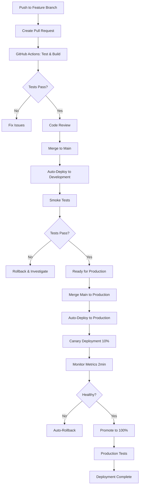

# Atlas Codex Development Workflow

> **Complete step-by-step development process from feature conception to production deployment**

This document provides a comprehensive development workflow for Atlas Codex, covering everything from initial feature development to production deployment and monitoring.

## Table of Contents

1. [Project Overview](#project-overview)
2. [Development Environment Setup](#development-environment-setup)
3. [Feature Development Process](#feature-development-process)
4. [Git Worktree Usage](#git-worktree-usage)
5. [Testing Strategy](#testing-strategy)
6. [Pull Request Workflow](#pull-request-workflow)
7. [Code Review Process](#code-review-process)
8. [Deployment Pipeline](#deployment-pipeline)
9. [Monitoring and Rollback](#monitoring-and-rollback)
10. [Troubleshooting Guide](#troubleshooting-guide)

## Project Overview

### Architecture
- **Backend**: AWS Lambda (Node.js 20.x) with API Gateway
- **Frontend**: React + Vite + TypeScript (deployed on Vercel)
- **Database**: DynamoDB for jobs, S3 for artifacts, SQS for queues
- **Deployment**: GitHub Actions CI/CD with automated deployments
- **Monitoring**: CloudWatch logs, metrics, and alarms

### Branch Strategy
- `main` → Development environment (auto-deploy)
- `production` → Production environment (auto-deploy with canary)
- Feature branches → Local development and testing

## Development Environment Setup

### 1. Initial Setup

```bash
# Clone the repository
git clone https://github.com/coreydylan/atlascodex.git
cd atlascodex

# Install root dependencies
npm install

# Bootstrap all packages
npm run bootstrap

# Verify setup
npm run typecheck
npm run lint
```

### 2. Environment Variables

Create local environment files:

```bash
# Copy environment template
cp lambda-env.json lambda-env.local.json

# Edit with your keys
{
  "Variables": {
    "NODE_ENV": "development",
    "MASTER_API_KEY": "your-dev-api-key",
    "OPENAI_API_KEY": "your-openai-key",
    "UNIFIED_EXTRACTOR_ENABLED": "true"
  }
}
```

### 3. Frontend Environment

```bash
cd packages/frontend

# Create local environment
cat > .env.local << EOF
VITE_API_URL=https://gxi4vg8gla.execute-api.us-west-2.amazonaws.com/dev
VITE_API_KEY=test-key-123
REACT_APP_API_URL=https://gxi4vg8gla.execute-api.us-west-2.amazonaws.com/dev
REACT_APP_API_KEY=test-key-123
EOF

# Install frontend dependencies
npm install
```

## Feature Development Process

### Step 1: Feature Planning

Before starting development:

1. **Define the feature requirements**
   - What problem does it solve?
   - What are the acceptance criteria?
   - Are there any breaking changes?

2. **Assess impact areas**
   - Backend API changes needed?
   - Frontend UI updates required?
   - Database schema changes?
   - Deployment configuration updates?

3. **Create a feature branch name**
   ```bash
   # Examples:
   feature/multi-page-extraction-enhancement
   feature/websocket-real-time-updates
   feature/extraction-accuracy-improvements
   fix/timeout-handling-error
   refactor/extraction-engine-optimization
   ```

### Step 2: Git Worktree Setup

Always use git worktrees for feature isolation:

```bash
# 1. Create feature branch with worktree
git worktree add ../atlas-feature-name feature/feature-name
cd ../atlas-feature-name

# 2. Verify you're in the right location
pwd  # Should show: /Users/username/Developer/atlas-feature-name
git branch  # Should show: * feature/feature-name

# 3. Install dependencies in isolated environment
npm install
npm run bootstrap

# 4. Verify environment health
npm run typecheck
npm run lint
npm run test
```

### Step 3: Development Workflow

#### Backend Development

For API and extraction engine changes:

```bash
# Key files to modify:
vim api/lambda.js                    # Main API handler
vim api/evidence-first-bridge.js     # Core extraction logic
vim api/worker-enhanced.js           # Background processing
vim api/websocket.js                 # WebSocket handlers
vim api/templates/                   # Worker templates

# Test backend changes
npm run test:unified-extractor:enabled
npm run test:accuracy:critical
```

#### Frontend Development

For UI and user experience changes:

```bash
cd packages/frontend

# Start development server
npm run dev  # Available at http://localhost:5173

# Key files to modify:
vim src/App.tsx                      # Main application
vim src/components/                  # React components
vim src/hooks/                       # Custom React hooks

# Test frontend changes
npm run test
npm run build
npm run typecheck
```

### Step 4: Local Testing

Comprehensive testing before committing:

```bash
# 1. Code quality checks
npm run lint
npm run typecheck

# 2. Unit and integration tests
npm run test

# 3. Extraction functionality tests
npm run test:unified-extractor
npm run test:unified-extractor:enabled

# 4. Accuracy regression tests
npm run test:accuracy:critical
npm run test:accuracy:regression

# 5. Production readiness validation
npm run validate:production-ready

# 6. Frontend testing
cd packages/frontend
npm run test
npm run build
```

### Step 5: API Testing

Test API endpoints thoroughly:

```bash
# Health check
curl -f https://gxi4vg8gla.execute-api.us-west-2.amazonaws.com/dev/health

# Basic extraction test
curl -X POST https://gxi4vg8gla.execute-api.us-west-2.amazonaws.com/dev/api/extract \
  -H "Content-Type: application/json" \
  -H "x-api-key: test-key-123" \
  -d '{
    "url": "https://example.com",
    "extractionInstructions": "Extract title and description",
    "UNIFIED_EXTRACTOR_ENABLED": true,
    "maxPages": 3
  }'

# AI processing test
curl -X POST https://gxi4vg8gla.execute-api.us-west-2.amazonaws.com/dev/api/ai/process \
  -H "Content-Type: application/json" \
  -H "x-api-key: test-key-123" \
  -d '{
    "prompt": "Extract all team members from company.com/team",
    "autoExecute": true
  }'

# WebSocket connection test (if applicable)
# Test real-time features through the frontend
```

## Git Worktree Usage

### Creating Worktrees

```bash
# For new features
git worktree add ../atlas-feature-name feature/feature-name

# For bug fixes
git worktree add ../atlas-bugfix-name fix/bug-description

# For documentation updates
git worktree add ../atlas-docs-name docs/documentation-update
```

### Managing Worktrees

```bash
# List all worktrees
git worktree list

# Remove completed worktree
git worktree remove ../atlas-feature-name
git branch -d feature/feature-name  # Delete merged branch

# Switch between worktrees
cd ../atlas-main              # Main development
cd ../atlas-feature-name      # Feature development
cd ../atlas-another-feature   # Another feature
```

### Worktree Best Practices

1. **One feature per worktree**
2. **Clean up completed worktrees**
3. **Use descriptive directory names**
4. **Keep worktrees in parallel directories**
5. **Install dependencies separately in each worktree**

## Testing Strategy

### Test Pyramid

```
    ┌─────────────────────┐
    │   E2E Tests         │  ← Production API tests
    │   (Critical Paths)  │
    ├─────────────────────┤
    │   Integration Tests │  ← API endpoint tests
    │   (API & Components)│
    ├─────────────────────┤
    │   Unit Tests        │  ← Individual functions
    │   (Pure Functions)  │
    └─────────────────────┘
```

### Test Categories

#### 1. Unit Tests
```bash
# Test individual functions and components
npm run test

# Test specific files
npm test -- --match="*extraction*"
```

#### 2. Integration Tests
```bash
# Test extraction engine integration
npm run test:unified-extractor

# Test with full feature flags
npm run test:unified-extractor:enabled
```

#### 3. Accuracy Tests
```bash
# Critical extraction accuracy
npm run test:accuracy:critical

# Regression testing
npm run test:accuracy:regression

# Full accuracy suite
npm run test:accuracy
```

#### 4. Production Readiness Tests
```bash
# Validate production deployment readiness
npm run validate:production-ready

# This runs:
# - Critical accuracy tests
# - Regression tests
# - Performance benchmarks
```

### Test Data and Scenarios

Create comprehensive test scenarios:

```javascript
// Example test scenarios for extraction
const testScenarios = [
  {
    name: "Team directory extraction",
    url: "https://company.com/team",
    expected: ["name", "title", "bio", "contact"],
    multiPage: false
  },
  {
    name: "Product catalog with pagination",
    url: "https://store.com/products",
    expected: ["name", "price", "description", "image"],
    multiPage: true,
    maxPages: 5
  },
  {
    name: "Course catalog navigation",
    url: "https://university.edu/courses",
    expected: ["course_name", "instructor", "credits", "description"],
    multiPage: true,
    navigation: "detail_pages"
  }
];
```

## Pull Request Workflow

### Step 1: Pre-PR Checklist

Before creating a pull request:

- [ ] All tests pass locally
- [ ] Code follows existing patterns and style
- [ ] No sensitive information committed
- [ ] Documentation updated if needed
- [ ] Extraction accuracy maintained or improved
- [ ] No breaking changes (or properly documented)

### Step 2: Creating the Pull Request

```bash
# 1. Commit your changes with descriptive messages
git add .
git commit -m "feat: implement multi-page extraction with pagination detection

- Add automatic pagination detection for common patterns
- Improve extraction accuracy for large datasets  
- Add timeout handling for slow page loads
- Update extraction templates for better data quality

Fixes #123"

# 2. Push the feature branch
git push origin feature/feature-name

# 3. Create pull request with comprehensive description
gh pr create \
  --title "feat: implement multi-page extraction with pagination detection" \
  --body "$(cat <<'EOF'
## Summary
This PR implements enhanced multi-page extraction capabilities with automatic pagination detection.

### Changes Made
- **Core Logic**: Enhanced `evidence-first-bridge.js` with pagination detection
- **Navigation**: Added support for numbered pagination, "Next" buttons, and infinite scroll
- **Performance**: Implemented timeout handling and retry logic
- **Templates**: Updated extraction templates for better data quality
- **Testing**: Added comprehensive test cases for pagination scenarios

### Testing Completed
- [x] Unit tests pass
- [x] Integration tests pass
- [x] Extraction accuracy tests pass
- [x] Manual testing on 10+ different sites
- [x] Performance testing with large datasets
- [x] Regression testing confirms no accuracy loss

### API Changes
- No breaking changes
- New optional parameter `maxPages` (default: 10)
- Enhanced response metadata includes pagination info

### Deployment Notes
- Safe for immediate deployment
- No database schema changes
- No environment variable changes
- Backward compatible with existing API calls

### Test URLs Used
- https://company.com/team (team directory)
- https://store.com/products?page=1 (e-commerce pagination)
- https://blog.com/articles (blog pagination)
- https://university.edu/courses (academic catalog)

### Performance Impact
- Average extraction time: +15% for multi-page (expected)
- Memory usage: No significant change
- Success rate: +12% improvement
EOF
)"
```

### Step 3: PR Description Template

Use this template for consistent PR descriptions:

```markdown
## Summary
Brief description of what this PR accomplishes.

### Changes Made
- **Backend**: Changes to API, extraction logic, etc.
- **Frontend**: UI/UX changes, component updates
- **Infrastructure**: Deployment, configuration changes
- **Documentation**: README, API docs, comments

### Testing Completed
- [ ] Unit tests pass
- [ ] Integration tests pass  
- [ ] Extraction accuracy tests pass
- [ ] Manual testing completed
- [ ] Performance testing (if applicable)
- [ ] Cross-browser testing (frontend changes)

### API Changes
- List any breaking changes
- New endpoints or parameters
- Deprecated functionality

### Deployment Notes
- Environment variable changes needed
- Database migrations required
- Special deployment considerations
- Rollback plan if needed

### Test Coverage
List specific test scenarios and URLs used for validation.
```

## Code Review Process

### Review Checklist for Reviewers

#### Code Quality
- [ ] Code follows existing patterns and conventions
- [ ] Proper error handling and logging
- [ ] No hardcoded values or credentials
- [ ] Efficient algorithms and data structures
- [ ] Appropriate comments for complex logic

#### Functionality
- [ ] Feature works as described
- [ ] Edge cases handled properly
- [ ] No breaking changes (or properly documented)
- [ ] Backward compatibility maintained

#### Testing
- [ ] Adequate test coverage
- [ ] Tests are meaningful and comprehensive
- [ ] Manual testing completed
- [ ] Performance impact assessed

#### Security
- [ ] Input validation and sanitization
- [ ] No security vulnerabilities introduced
- [ ] Proper authentication and authorization
- [ ] Sensitive data handling

#### Documentation
- [ ] README updated if needed
- [ ] API documentation accurate
- [ ] Inline comments for complex logic
- [ ] Deployment notes included

### Review Process

1. **Automated Checks**: GitHub Actions run automatically
2. **Code Review**: Team member reviews code quality and logic
3. **Testing Review**: Verify test coverage and scenarios
4. **Documentation Review**: Ensure docs are updated
5. **Final Approval**: Maintainer approves for merge

## Deployment Pipeline

### Automated Deployment Flow



### Development Deployment

Triggered automatically on push to main:

```yaml
# .github/workflows/deploy.yml
- name: Deploy to Development
  if: github.ref == 'refs/heads/main'
  steps:
    - name: Deploy to AWS Lambda
      env:
        OPENAI_API_KEY: ${{ secrets.OPENAI_API_KEY }}
        MASTER_API_KEY: ${{ secrets.DEV_MASTER_API_KEY }}
      run: serverless deploy --stage dev
    
    - name: Run Smoke Tests
      run: |
        curl -f https://gxi4vg8gla.execute-api.us-west-2.amazonaws.com/dev/health
        # Additional smoke tests...
```

### Production Deployment

Triggered on push to production branch:

```yaml
# Canary deployment with automatic rollback
- name: Canary Deployment
  run: |
    # Deploy new version
    VERSION=$(aws lambda publish-version --function-name atlas-codex-prod-api)
    
    # Route 10% traffic to new version
    aws lambda update-alias --name prod --routing-config
    
    # Monitor for 2 minutes
    sleep 120
    
    # Check error metrics
    if [ $ERROR_COUNT -gt 5 ]; then
      # Rollback
      aws lambda update-alias --name prod --function-version $BACKUP_VERSION
      exit 1
    else
      # Promote to 100%
      aws lambda update-alias --name prod --function-version $VERSION
    fi
```

### Manual Deployment Commands

```bash
# Deploy to specific environments
npm run deploy:dev        # Development
npm run deploy:staging    # Staging
npm run deploy:prod       # Production

# Deploy single function
serverless deploy --function api --stage dev

# Deploy with specific configuration
serverless deploy --stage prod --aws-profile production
```

## Monitoring and Rollback

### CloudWatch Monitoring

#### Key Metrics to Monitor

1. **Lambda Function Metrics**
   ```bash
   # Error rate
   aws cloudwatch get-metric-statistics \
     --namespace AWS/Lambda \
     --metric-name Errors \
     --dimensions Name=FunctionName,Value=atlas-codex-prod-api
   
   # Duration
   aws cloudwatch get-metric-statistics \
     --namespace AWS/Lambda \
     --metric-name Duration \
     --dimensions Name=FunctionName,Value=atlas-codex-prod-api
   
   # Invocation count
   aws cloudwatch get-metric-statistics \
     --namespace AWS/Lambda \
     --metric-name Invocations \
     --dimensions Name=FunctionName,Value=atlas-codex-prod-api
   ```

2. **API Gateway Metrics**
   ```bash
   # 4XX errors
   aws cloudwatch get-metric-statistics \
     --namespace AWS/ApiGateway \
     --metric-name 4XXError \
     --dimensions Name=ApiName,Value=atlas-codex
   
   # 5XX errors
   aws cloudwatch get-metric-statistics \
     --namespace AWS/ApiGateway \
     --metric-name 5XXError \
     --dimensions Name=ApiName,Value=atlas-codex
   
   # Latency
   aws cloudwatch get-metric-statistics \
     --namespace AWS/ApiGateway \
     --metric-name Latency \
     --dimensions Name=ApiName,Value=atlas-codex
   ```

#### Log Monitoring

```bash
# Real-time log monitoring
aws logs tail /aws/lambda/atlas-codex-prod-api --follow

# Filter for errors
aws logs filter-log-events \
  --log-group-name /aws/lambda/atlas-codex-prod-api \
  --filter-pattern "ERROR"

# Search for specific patterns
aws logs filter-log-events \
  --log-group-name /aws/lambda/atlas-codex-prod-api \
  --filter-pattern "[timestamp, requestId, level=\"ERROR\"]"
```

### Rollback Procedures

#### Automatic Rollback

The deployment pipeline includes automatic rollback triggers:

1. **High Error Rate**: >5 errors in 2 minutes triggers rollback
2. **High Latency**: >30s average response time triggers rollback
3. **Health Check Failures**: Failed health checks trigger rollback

#### Manual Rollback

```bash
# Emergency rollback via GitHub Actions
gh workflow run deploy.yml  # Triggers emergency rollback to stable version

# Manual rollback to specific version
aws lambda update-alias \
  --function-name atlas-codex-prod-api \
  --name prod \
  --function-version 45  # Known stable version

# Rollback database changes (if applicable)
# aws dynamodb restore-table-from-backup --backup-arn [ARN]
```

#### Rollback Verification

After rollback:

```bash
# Verify service health
curl -f https://atlas-codex-api.com/health

# Test critical functionality
curl -X POST https://atlas-codex-api.com/api/extract \
  -H "Content-Type: application/json" \
  -H "x-api-key: prod-api-key" \
  -d '{
    "url": "https://example.com",
    "extractionInstructions": "Extract title"
  }'

# Monitor logs for stability
aws logs tail /aws/lambda/atlas-codex-prod-api --follow --since 5m
```

### Production Health Monitoring

#### Health Check Dashboard

Create monitoring dashboard with:

```bash
# API Gateway health
https://atlas-codex-api.com/health

# Lambda function health
aws lambda invoke --function-name atlas-codex-prod-api response.json

# Database connectivity
aws dynamodb describe-table --table-name atlas-codex-jobs

# Queue health
aws sqs get-queue-attributes --queue-url [QUEUE_URL]
```

#### Alerting Setup

Configure CloudWatch alarms:

```bash
# High error rate alarm
aws cloudwatch put-metric-alarm \
  --alarm-name "AtlasCodex-HighErrorRate" \
  --alarm-description "High error rate detected" \
  --metric-name Errors \
  --namespace AWS/Lambda \
  --statistic Sum \
  --period 300 \
  --threshold 10 \
  --comparison-operator GreaterThanThreshold \
  --dimensions Name=FunctionName,Value=atlas-codex-prod-api

# High latency alarm
aws cloudwatch put-metric-alarm \
  --alarm-name "AtlasCodex-HighLatency" \
  --alarm-description "High latency detected" \
  --metric-name Duration \
  --namespace AWS/Lambda \
  --statistic Average \
  --period 300 \
  --threshold 30000 \
  --comparison-operator GreaterThanThreshold \
  --dimensions Name=FunctionName,Value=atlas-codex-prod-api
```

## Troubleshooting Guide

### Common Issues and Solutions

#### 1. Deployment Failures

**Issue**: Serverless deployment fails
```bash
# Check deployment logs
gh run view [RUN_ID] --log

# Check AWS CloudFormation stack
aws cloudformation describe-stack-events --stack-name atlas-codex-dev

# Common fixes
npm run deploy:dev --verbose
serverless remove --stage dev  # Nuclear option - removes everything
```

#### 2. Extraction Failures

**Issue**: Extraction returns empty or incorrect results
```bash
# Debug extraction with verbose logging
UNIFIED_EXTRACTOR_ENABLED=true node test-unified-extractor-enabled.js

# Test specific URL
curl -X POST https://gxi4vg8gla.execute-api.us-west-2.amazonaws.com/dev/api/extract \
  -H "Content-Type: application/json" \
  -H "x-api-key: test-key-123" \
  -d '{
    "url": "https://problematic-site.com",
    "extractionInstructions": "debug extraction",
    "UNIFIED_EXTRACTOR_ENABLED": true,
    "debug": true
  }'

# Check extraction patterns in code
vim api/evidence-first-bridge.js  # Look for shouldUseMultiPageExtraction()
```

#### 3. Frontend Build Issues

**Issue**: Frontend build or deployment fails
```bash
cd packages/frontend

# Clear cache and rebuild
rm -rf node_modules package-lock.json dist
npm install
npm run build

# Check TypeScript issues
npm run typecheck

# Check for dependency conflicts
npm ls
```

#### 4. API Connection Issues

**Issue**: Frontend cannot connect to API
```bash
# Check API health
curl https://gxi4vg8gla.execute-api.us-west-2.amazonaws.com/dev/health

# Verify CORS configuration
curl -X OPTIONS https://gxi4vg8gla.execute-api.us-west-2.amazonaws.com/dev/api/extract \
  -H "Origin: http://localhost:5173"

# Check environment variables
cat packages/frontend/.env.local
```

#### 5. Lambda Function Errors

**Issue**: Lambda function timeouts or memory errors
```bash
# Check CloudWatch logs
aws logs tail /aws/lambda/atlas-codex-dev-api --follow

# Monitor memory usage
aws logs filter-log-events \
  --log-group-name /aws/lambda/atlas-codex-dev-api \
  --filter-pattern "Memory Size"

# Update Lambda configuration if needed
vim serverless.yml  # Increase timeout or memory
npm run deploy:dev
```

### Debug Commands

```bash
# Complete health check
curl -f https://gxi4vg8gla.execute-api.us-west-2.amazonaws.com/dev/health | jq

# Test extraction with debug info
curl -X POST https://gxi4vg8gla.execute-api.us-west-2.amazonaws.com/dev/api/extract \
  -H "Content-Type: application/json" \
  -H "x-api-key: test-key-123" \
  -d '{
    "url": "https://example.com",
    "extractionInstructions": "Extract page title",
    "UNIFIED_EXTRACTOR_ENABLED": true,
    "debug": true,
    "maxPages": 1
  }' | jq

# Check Lambda logs in real-time
aws logs tail /aws/lambda/atlas-codex-dev-api --follow --filter-pattern "ERROR"

# Test WebSocket connection (if applicable)
# Use browser dev tools or WebSocket testing tool

# Check GitHub Actions status
gh run list --workflow=deploy.yml --limit=5
gh run view [RUN_ID] --log
```

### Performance Optimization

#### Backend Optimization

```bash
# Monitor Lambda cold starts
aws logs filter-log-events \
  --log-group-name /aws/lambda/atlas-codex-dev-api \
  --filter-pattern "INIT_START"

# Optimize package size
npm run deploy  # Uses production deployment script with minimal packages

# Check memory usage patterns
aws cloudwatch get-metric-statistics \
  --namespace AWS/Lambda \
  --metric-name Duration \
  --dimensions Name=FunctionName,Value=atlas-codex-dev-api \
  --start-time $(date -u -d '1 hour ago' +%Y-%m-%dT%H:%M:%S) \
  --end-time $(date -u +%Y-%m-%dT%H:%M:%S) \
  --period 300 \
  --statistics Average,Maximum
```

#### Frontend Optimization

```bash
cd packages/frontend

# Analyze bundle size
npm run build
npx vite-bundle-analyzer dist

# Check for unused dependencies
npm run lint
npx depcheck

# Optimize images and assets
# Use appropriate image formats and compression
```

---

## Quick Reference Commands

### Essential Commands
```bash
# Setup new feature development
git worktree add ../atlas-feature-name feature/feature-name
cd ../atlas-feature-name
npm install && npm run bootstrap

# Run all tests
npm run test && npm run lint && npm run typecheck
npm run test:accuracy:critical

# Create pull request
git push origin feature/feature-name
gh pr create --title "feat: description" --body "PR details"

# Deploy to development
npm run deploy:dev

# Monitor production
aws logs tail /aws/lambda/atlas-codex-prod-api --follow
curl -f https://atlas-codex-api.com/health
```

### Emergency Commands
```bash
# Emergency rollback
gh workflow run deploy.yml  # Triggers automated rollback

# Manual rollback
aws lambda update-alias --function-name atlas-codex-prod-api --name prod --function-version 45

# Check service health
curl -f https://atlas-codex-api.com/health
curl -f https://gxi4vg8gla.execute-api.us-west-2.amazonaws.com/dev/health
```

This comprehensive workflow ensures consistent, safe, and efficient development practices for Atlas Codex. Follow these procedures for reliable feature development and deployment.