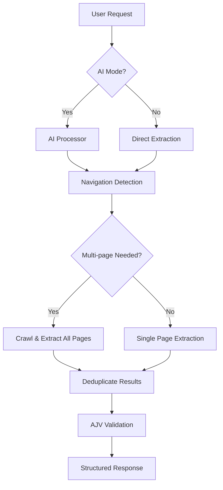

# Atlas Codex

> **Navigation-Enhanced Universal Data Extraction Platform**

Atlas Codex is a production-ready, AI-powered web extraction platform that intelligently navigates and extracts structured data from any website. Built with GPT-4o and smart navigation detection, it automatically handles single-page content, multi-page crawling, pagination, and complex site structures.

[](https://atlas-codex-ambxba6hp-experial.vercel.app)
[](https://gxi4vg8gla.execute-api.us-west-2.amazonaws.com/dev/health)
[](https://github.com/coreydylan/atlascodex)

## 🚀 Live Demo

- **Frontend Application**: [atlas-codex-ambxba6hp-experial.vercel.app](https://atlas-codex-ambxba6hp-experial.vercel.app)
- **API Endpoint**: `https://gxi4vg8gla.execute-api.us-west-2.amazonaws.com/dev`
- **Health Check**: [API Health Status](https://gxi4vg8gla.execute-api.us-west-2.amazonaws.com/dev/health)

## ✨ Key Features

### 🧠 **Smart Navigation Detection**
- **Auto-Detection**: Automatically determines when multi-page extraction is beneficial
- **Explicit Control**: Supports natural language requests like "crawl all pages" or "get complete catalog"
- **Pattern Recognition**: Identifies pagination, detail pages, and site structures intelligently

### 🎯 **Universal Extraction**
- **Any Content Type**: Team directories, product catalogs, course listings, article archives
- **Any Site Structure**: Single pages, paginated results, nested categories, detail links
- **Clean Results**: Structured JSON output with comprehensive metadata

### 🔧 **Production-Ready Architecture**
- **AWS Lambda**: Serverless backend with automatic scaling
- **React Frontend**: Modern UI with real-time extraction feedback
- **GPT-4o Integration**: Latest AI model for superior extraction quality
- **AJV Validation**: Strict schema enforcement with phantom field prevention

## 🏗️ Architecture Overview



### Core Components

- **`api/lambda.js`**: Main Lambda handler and request routing
- **`api/evidence-first-bridge.js`**: Navigation-enhanced unified extractor engine
- **`api/worker-enhanced.js`**: Plan-based fallback system
- **`api/atlas-generator-integration.js`**: AI processing and natural language understanding
- **`packages/frontend/`**: React application with real-time UI
- **`packages/core/`**: Shared schema contracts and type definitions

## 🚀 Quick Start

### Prerequisites
- Node.js 20+
- AWS CLI configured
- Serverless Framework
- OpenAI API key

### 1. Clone & Install
```bash
git clone https://github.com/coreydylan/atlascodex.git
cd atlascodex
npm install
```

### 2. Environment Setup
```bash
# Copy environment template
cp lambda-env.json lambda-env.local.json

# Edit with your keys
{
  "Variables": {
    "NODE_ENV": "development",
    "MASTER_API_KEY": "your-api-key-here",
    "OPENAI_API_KEY": "your-openai-key-here",
    "UNIFIED_EXTRACTOR_ENABLED": "true"
  }
}
```

### 3. Deploy Backend
```bash
# Deploy to AWS
npm run deploy

# The API will be available at:
# https://YOUR-API-ID.execute-api.us-west-2.amazonaws.com/dev
```

### 4. Run Frontend Locally
```bash
cd packages/frontend
npm install
npm run dev

# Frontend available at http://localhost:5173
```

## 🔧 Usage Examples

### Direct API Usage

#### Basic Extraction
```bash
curl -X POST "https://gxi4vg8gla.execute-api.us-west-2.amazonaws.com/dev/api/extract" \
  -H "Content-Type: application/json" \
  -H "X-Api-Key: YOUR_KEY" \
  -d '{
    "url": "https://example.com/team",
    "extractionInstructions": "extract name, title, and bio from team members",
    "UNIFIED_EXTRACTOR_ENABLED": true
  }'
```

#### Multi-Page Extraction
```bash
curl -X POST "https://gxi4vg8gla.execute-api.us-west-2.amazonaws.com/dev/api/extract" \
  -H "Content-Type: application/json" \
  -H "X-Api-Key: YOUR_KEY" \
  -d '{
    "url": "https://example.com/products", 
    "extractionInstructions": "extract all products - navigate through all pages",
    "UNIFIED_EXTRACTOR_ENABLED": true
  }'
```

#### AI-Powered Mode
```bash
curl -X POST "https://gxi4vg8gla.execute-api.us-west-2.amazonaws.com/dev/api/ai/process" \
  -H "Content-Type: application/json" \
  -H "X-Api-Key: YOUR_KEY" \
  -d '{
    "prompt": "get all team members with full bios from company.com/team",
    "UNIFIED_EXTRACTOR_ENABLED": true,
    "autoExecute": true
  }'
```

### Frontend Usage

1. **Visit**: [atlas-codex-ambxba6hp-experial.vercel.app](https://atlas-codex-ambxba6hp-experial.vercel.app)
2. **Toggle AI Mode**: Enable "AI-Powered Unified Extraction"  
3. **Enter Request**: Natural language like "get all products from store.com"
4. **Review Results**: Structured JSON with extraction metadata

## 📊 Extraction Capabilities

### Supported Content Types
- ✅ **Team/Staff Directories**: Individual profiles, contact info, bios
- ✅ **Product Catalogs**: E-commerce listings, specifications, pricing  
- ✅ **Course Catalogs**: Academic programs, descriptions, requirements
- ✅ **Article Archives**: News, blogs, documentation with pagination
- ✅ **Event Listings**: Conferences, meetups, schedules
- ✅ **Directory Listings**: Business directories, service providers
- ✅ **Any Structured Content**: Universal pattern recognition

### Navigation Patterns
- ✅ **Pagination**: "Next", "Page 2", numbered pagination
- ✅ **Detail Pages**: "View Profile", "Read More", "Learn More" links  
- ✅ **Category Drilling**: Department → Subdepartment → Individual items
- ✅ **Search Results**: Multi-page search result navigation
- ✅ **Infinite Scroll**: Load more patterns and dynamic content

## 🏭 Production Deployment

### Current Production Environment

#### Backend (AWS)
- **Service**: `atlas-codex-dev`
- **Region**: `us-west-2`
- **API Gateway**: `https://gxi4vg8gla.execute-api.us-west-2.amazonaws.com/dev`
- **Lambda Functions**:
  - `atlas-codex-dev-api`: Main request handler
  - `atlas-codex-dev-worker`: Background processing
  - WebSocket handlers for real-time updates

#### Frontend (Vercel)
- **Domain**: `atlas-codex-ambxba6hp-experial.vercel.app`
- **Framework**: React + Vite + TypeScript
- **Deployment**: Automatic from `main` branch
- **Environment**: Production-optimized builds

### Deployment Commands

#### Backend Deployment
```bash
# Deploy all functions
npm run deploy

# Deploy specific function
npm run deploy:dev
npm run deploy:staging  
npm run deploy:prod

# Deploy single function
serverless deploy --function api
```

#### Frontend Deployment  
```bash
cd packages/frontend

# Deploy to Vercel (automatic on git push)
vercel deploy

# Production deployment
vercel --prod
```

### Environment Configuration

#### AWS Lambda Environment Variables
```yaml
environment:
  NODE_ENV: ${self:custom.stage.${self:provider.stage}.NODE_ENV}
  MASTER_API_KEY: ${env:MASTER_API_KEY}
  OPENAI_API_KEY: ${env:OPENAI_API_KEY}
  UNIFIED_EXTRACTOR_ENABLED: ${env:UNIFIED_EXTRACTOR_ENABLED}
```

#### Frontend Environment Variables
```bash
# .env.local
VITE_API_URL=https://gxi4vg8gla.execute-api.us-west-2.amazonaws.com/dev
VITE_API_KEY=your-api-key-here
REACT_APP_API_URL=https://gxi4vg8gla.execute-api.us-west-2.amazonaws.com/dev  
REACT_APP_API_KEY=your-api-key-here
```

## 🔍 API Reference

### Endpoints

#### `GET /health`
Health check endpoint
```json
{
  "status": "healthy",
  "message": "Atlas Codex API is running!",
  "version": "2.0.0",
  "features": {
    "dynamodb": true,
    "sqs": true,
    "s3": true
  }
}
```

#### `POST /api/extract`
Direct extraction endpoint
```json
{
  "url": "https://example.com",
  "extractionInstructions": "extract name and title from team members",
  "UNIFIED_EXTRACTOR_ENABLED": true,
  "maxPages": 10,
  "maxDepth": 2
}
```

#### `POST /api/ai/process`  
AI-powered natural language processing
```json
{
  "prompt": "get all products from store.com with prices",
  "UNIFIED_EXTRACTOR_ENABLED": true,
  "autoExecute": true
}
```

### Response Format
```json
{
  "jobId": "extract_1234567890_abc123",
  "status": "completed",
  "message": "Extraction completed", 
  "result": {
    "success": true,
    "data": [
      {
        "name": "John Doe",
        "title": "Software Engineer",
        "bio": "Experienced developer..."
      }
    ],
    "metadata": {
      "processingMethod": "unified_extractor_navigation_aware",
      "unifiedExtractor": true,
      "multiPage": true,
      "processingTime": 4641,
      "crawlResults": {
        "totalPagesFound": 3,
        "pagesProcessed": 3,
        "pagesSuccessful": 3,
        "totalItems": 12
      }
    }
  }
}
```

## 🛠️ Development

### Project Structure
```
atlas-codex/
├── api/                          # Backend Lambda functions
│   ├── lambda.js                # Main request handler
│   ├── evidence-first-bridge.js # Unified extractor engine  
│   ├── worker-enhanced.js       # Fallback extraction system
│   └── atlas-generator-integration.js # AI processing
├── packages/
│   ├── frontend/               # React application
│   │   ├── src/
│   │   │   ├── App.tsx        # Main application component
│   │   │   └── components/    # Reusable UI components
│   │   ├── package.json
│   │   └── vercel.json       # Frontend deployment config
│   └── core/                 # Shared library
│       ├── src/
│       │   ├── index.ts      # Main exports
│       │   └── schema-contracts.ts # Schema definitions
│       └── package.json
├── docs/                     # Documentation
├── serverless.yml           # AWS deployment configuration
├── package.json            # Root dependencies and scripts
└── lambda-env.json         # Environment template
```

### Development Workflow

#### 1. Local Development
```bash
# Install dependencies
npm install

# Start local development
cd packages/frontend
npm run dev

# Test API endpoints  
curl https://gxi4vg8gla.execute-api.us-west-2.amazonaws.com/dev/health
```

#### 2. Testing
```bash
# Run frontend tests
cd packages/frontend
npm test

# Test extraction functionality
npm run test:unified-extractor

# Validate production readiness
npm run validate:production-ready
```

#### 3. Deployment
```bash
# Deploy backend changes
npm run deploy

# Frontend deploys automatically on push to main

# Verify deployment
curl https://your-api-gateway-url/dev/health
```

### Adding New Features

#### 1. Extraction Enhancements
- Modify `api/evidence-first-bridge.js` for extraction logic
- Update navigation detection in `shouldUseMultiPageExtraction()`
- Add new patterns to `performNavigationAwareExtraction()`

#### 2. Frontend Features  
- Add components to `packages/frontend/src/components/`
- Update main app logic in `packages/frontend/src/App.tsx`
- Follow existing TypeScript and React patterns

#### 3. API Endpoints
- Add routes to `api/lambda.js`
- Follow existing error handling and response patterns
- Update API documentation

## 🤝 Contributing

We welcome contributions! Please follow these guidelines:

### Getting Started
1. Fork the repository
2. Create a feature branch: `git checkout -b feature/amazing-feature`
3. Make your changes following our coding standards
4. Test thoroughly (all production endpoints must remain functional)
5. Submit a pull request with a clear description

### Coding Standards
- **TypeScript**: Strict typing for frontend components
- **ESLint**: Follow existing linting rules  
- **Error Handling**: Comprehensive error handling with user-friendly messages
- **Documentation**: Update README and inline comments for new features
- **Testing**: Include tests for new extraction patterns

### Pull Request Process
1. Ensure all tests pass
2. Update documentation for any API changes
3. Include example usage for new features
4. Get approval from maintainers
5. Squash commits before merging

## 📝 License

This project is licensed under the MIT License - see the [LICENSE](LICENSE) file for details.

## 🆘 Support & Issues

- **Issues**: [GitHub Issues](https://github.com/coreydylan/atlascodex/issues)
- **Discussions**: [GitHub Discussions](https://github.com/coreydylan/atlascodex/discussions)  
- **Documentation**: [Wiki](https://github.com/coreydylan/atlascodex/wiki)

## 🚀 Roadmap

### Short Term
- [ ] Enhanced error handling and retry logic
- [ ] Batch processing for multiple URLs
- [ ] Performance optimizations and caching
- [ ] Extended schema validation options

### Medium Term  
- [ ] Custom extraction rules and templates
- [ ] Webhook notifications for completed extractions
- [ ] Rate limiting and usage analytics
- [ ] Advanced crawling strategies

### Long Term
- [ ] Multi-region deployment
- [ ] Enterprise authentication and authorization
- [ ] GraphQL API interface
- [ ] Machine learning model fine-tuning

---

**Atlas Codex** - Built with ❤️ for universal web extraction

*Last updated: September 4, 2025*