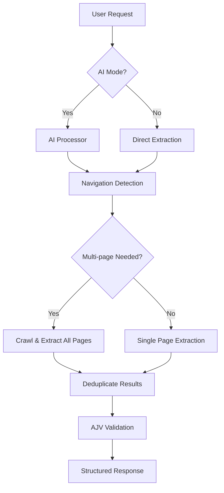
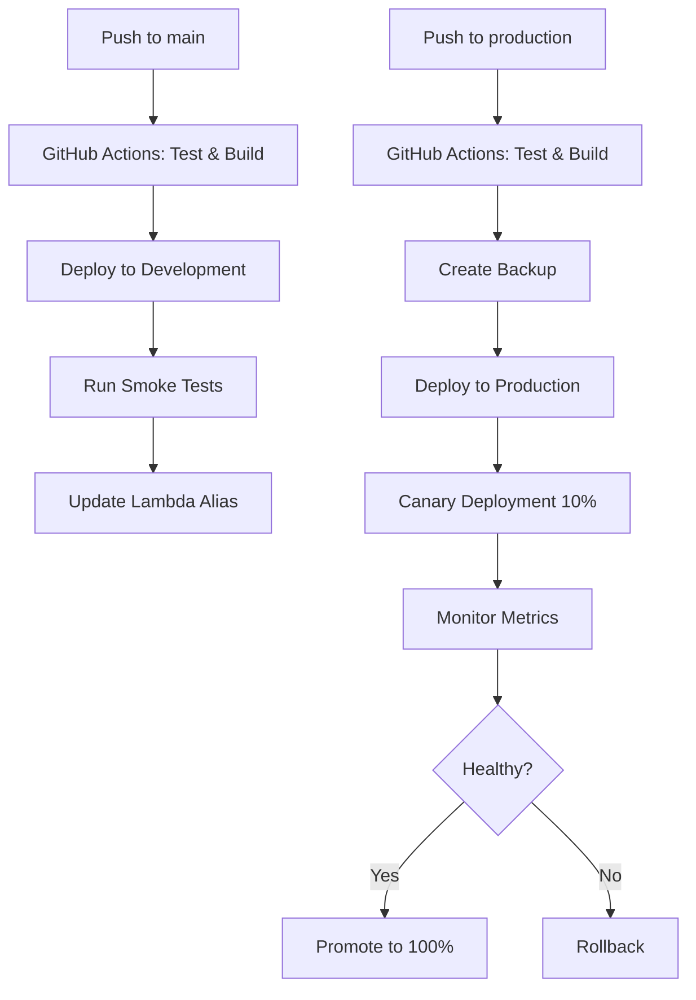

# Atlas Codex

> **Navigation-Enhanced Universal Data Extraction Platform**

Atlas Codex is a production-ready, AI-powered web extraction platform that intelligently navigates and extracts structured data from any website. Built with GPT-4o and smart navigation detection, it automatically handles single-page content, multi-page crawling, pagination, and complex site structures.

## 📚 GPT-5 Migration Resources

**Important**: We are actively migrating from GPT-4 to GPT-5 (released August 7, 2025). The system now includes async processing for complex extractions. Before making any AI/LLM changes, please review:
- **[GPT-5 Training Center](./gpt5-training/README.md)** - Comprehensive GPT-5 documentation and migration guides
- **[Refactoring Report](./gpt5-training/REFACTORING_REPORT.md)** - Detailed analysis and migration roadmap
- **[Migration Guide](./gpt5-training/migration-guide/step-by-step.md)** - Step-by-step migration instructions
- **[Extraction Patterns](./gpt5-training/cookbook-examples/extraction-patterns.js)** - GPT-5 extraction patterns and best practices

[](https://atlas-codex-ambxba6hp-experial.vercel.app)
[](https://gxi4vg8gla.execute-api.us-west-2.amazonaws.com/dev/health)
[](https://github.com/coreydylan/atlascodex)

## 🚀 Live Demo

- **Frontend Application**: [atlas-codex-ambxba6hp-experial.vercel.app](https://atlas-codex-ambxba6hp-experial.vercel.app)
- **API Endpoint**: `https://gxi4vg8gla.execute-api.us-west-2.amazonaws.com/dev`
- **Health Check**: [API Health Status](https://gxi4vg8gla.execute-api.us-west-2.amazonaws.com/dev/health)

## ✨ Key Features

### 🧠 **Smart Navigation Detection**
- **Auto-Detection**: Automatically determines when multi-page extraction is beneficial
- **Explicit Control**: Supports natural language requests like "crawl all pages" or "get complete catalog"
- **Pattern Recognition**: Identifies pagination, detail pages, and site structures intelligently

### 🎯 **Universal Extraction**
- **Any Content Type**: Team directories, product catalogs, course listings, article archives
- **Any Site Structure**: Single pages, paginated results, nested categories, detail links
- **Clean Results**: Structured JSON output with comprehensive metadata

### 🔧 **Production-Ready Architecture**
- **AWS Lambda**: Serverless backend with automatic scaling
- **React Frontend**: Modern UI with real-time extraction feedback
- **GPT-4o Integration**: Latest AI model for superior extraction quality
- **AJV Validation**: Strict schema enforcement with phantom field prevention

## 🏗️ Architecture Overview



### Core Components

- **`api/lambda.js`**: Main Lambda handler and request routing
- **`api/evidence-first-bridge.js`**: Navigation-enhanced unified extractor engine
- **`api/worker-enhanced.js`**: Plan-based fallback system
- **`api/atlas-generator-integration.js`**: AI processing and natural language understanding
- **`packages/frontend/`**: React application with real-time UI
- **`packages/core/`**: Shared schema contracts and type definitions

## 🚀 Quick Start

### Prerequisites
- Node.js 20+
- AWS CLI configured
- Serverless Framework
- OpenAI API key

### 1. Clone & Install
```bash
git clone https://github.com/coreydylan/atlascodex.git
cd atlascodex
npm install
```

### 2. Environment Setup
```bash
# Copy environment template
cp lambda-env.json lambda-env.local.json

# Edit with your keys
{
  "Variables": {
    "NODE_ENV": "development",
    "MASTER_API_KEY": "your-api-key-here",
    "OPENAI_API_KEY": "your-openai-key-here",
    "UNIFIED_EXTRACTOR_ENABLED": "true"
  }
}
```

### 3. Deploy Backend
```bash
# Deploy to AWS
npm run deploy

# The API will be available at:
# https://YOUR-API-ID.execute-api.us-west-2.amazonaws.com/dev
```

### 4. Run Frontend Locally
```bash
cd packages/frontend
npm install
npm run dev

# Frontend available at http://localhost:5173
```

## 🔧 Usage Examples

### Direct API Usage

#### Basic Extraction
```bash
curl -X POST "https://gxi4vg8gla.execute-api.us-west-2.amazonaws.com/dev/api/extract" \
  -H "Content-Type: application/json" \
  -H "X-Api-Key: YOUR_KEY" \
  -d '{
    "url": "https://example.com/team",
    "extractionInstructions": "extract name, title, and bio from team members",
    "UNIFIED_EXTRACTOR_ENABLED": true
  }'
```

#### Multi-Page Extraction
```bash
curl -X POST "https://gxi4vg8gla.execute-api.us-west-2.amazonaws.com/dev/api/extract" \
  -H "Content-Type: application/json" \
  -H "X-Api-Key: YOUR_KEY" \
  -d '{
    "url": "https://example.com/products", 
    "extractionInstructions": "extract all products - navigate through all pages",
    "UNIFIED_EXTRACTOR_ENABLED": true
  }'
```

#### AI-Powered Mode
```bash
curl -X POST "https://gxi4vg8gla.execute-api.us-west-2.amazonaws.com/dev/api/ai/process" \
  -H "Content-Type: application/json" \
  -H "X-Api-Key: YOUR_KEY" \
  -d '{
    "prompt": "get all team members with full bios from company.com/team",
    "UNIFIED_EXTRACTOR_ENABLED": true,
    "autoExecute": true
  }'
```

### Frontend Usage

1. **Visit**: [atlas-codex-ambxba6hp-experial.vercel.app](https://atlas-codex-ambxba6hp-experial.vercel.app)
2. **Toggle AI Mode**: Enable "AI-Powered Unified Extraction"  
3. **Enter Request**: Natural language like "get all products from store.com"
4. **Review Results**: Structured JSON with extraction metadata

## 📊 Extraction Capabilities

### Supported Content Types
- ✅ **Team/Staff Directories**: Individual profiles, contact info, bios
- ✅ **Product Catalogs**: E-commerce listings, specifications, pricing  
- ✅ **Course Catalogs**: Academic programs, descriptions, requirements
- ✅ **Article Archives**: News, blogs, documentation with pagination
- ✅ **Event Listings**: Conferences, meetups, schedules
- ✅ **Directory Listings**: Business directories, service providers
- ✅ **Any Structured Content**: Universal pattern recognition

### Navigation Patterns
- ✅ **Pagination**: "Next", "Page 2", numbered pagination
- ✅ **Detail Pages**: "View Profile", "Read More", "Learn More" links  
- ✅ **Category Drilling**: Department → Subdepartment → Individual items
- ✅ **Search Results**: Multi-page search result navigation
- ✅ **Infinite Scroll**: Load more patterns and dynamic content

## 🏭 Production Deployment & CI/CD

### Branch Strategy & Deployment Pipeline

#### Branch Structure
- **`main`** → Development Environment (Auto-deploy)
- **`production`** → Production Environment (Auto-deploy with canary rollout)
- **Feature branches** → No auto-deployment (manual testing only)

#### Automated CI/CD Pipeline


### Current Production Environment

#### Backend (AWS Lambda)
- **Service**: `atlas-codex-dev` (Development), `atlas-codex-prod` (Production)
- **Region**: `us-west-2`
- **Development API**: `https://gxi4vg8gla.execute-api.us-west-2.amazonaws.com/dev`
- **Production API**: `https://atlas-codex-api.com` (aliased)
- **Lambda Functions**:
  - `atlas-codex-{stage}-api`: Main request handler
  - `atlas-codex-{stage}-worker`: Background processing
  - WebSocket handlers for real-time updates

#### Frontend (Vercel)
- **Domain**: `atlas-codex-ambxba6hp-experial.vercel.app`
- **Framework**: React + Vite + TypeScript
- **Deployment**: Automatic from `main` branch
- **Environment**: Production-optimized builds

### Deployment Commands

#### Automated Deployment (Recommended)
```bash
# Deploy to development (triggers on main branch push)
git push origin main

# Deploy to production (triggers on production branch push)
git checkout production
git merge main
git push origin production
```

#### Manual Deployment
```bash
# Deploy to development
npm run deploy:dev

# Deploy to staging
npm run deploy:staging

# Deploy to production
npm run deploy:prod

# Deploy single function
serverless deploy --function api --stage dev
```

#### Emergency Rollback
```bash
# Trigger emergency rollback via GitHub Actions
gh workflow run deploy.yml

# Manual rollback to specific version
aws lambda update-alias \
  --function-name atlas-codex-prod-api \
  --name prod \
  --function-version 45
```

#### Frontend Deployment  
```bash
cd packages/frontend

# Deploy to Vercel (automatic on git push)
vercel deploy

# Production deployment
vercel --prod
```

### Environment Configuration

#### Required GitHub Secrets
```yaml
# AWS Credentials
AWS_ACCESS_KEY_ID: your-aws-access-key
AWS_SECRET_ACCESS_KEY: your-aws-secret-key

# API Keys
OPENAI_API_KEY: your-openai-key
DEV_MASTER_API_KEY: dev-api-key
PROD_MASTER_API_KEY: prod-api-key
```

#### AWS Lambda Environment Variables
```yaml
environment:
  NODE_ENV: ${self:custom.stage.${self:provider.stage}.NODE_ENV}
  MASTER_API_KEY: ${env:MASTER_API_KEY}
  OPENAI_API_KEY: ${env:OPENAI_API_KEY}
  UNIFIED_EXTRACTOR_ENABLED: ${env:UNIFIED_EXTRACTOR_ENABLED, 'true'}
  QUEUE_URL: !Ref JobQueue
```

#### Frontend Environment Variables
```bash
# .env.local (Development)
VITE_API_URL=https://gxi4vg8gla.execute-api.us-west-2.amazonaws.com/dev
VITE_API_KEY=dev-api-key

# .env.production (Production)
VITE_API_URL=https://atlas-codex-api.com
VITE_API_KEY=prod-api-key
```

### Deployment Verification

#### Health Checks
```bash
# Development health check
curl https://gxi4vg8gla.execute-api.us-west-2.amazonaws.com/dev/health

# Production health check
curl https://atlas-codex-api.com/health

# Test extraction endpoint
curl -X POST https://gxi4vg8gla.execute-api.us-west-2.amazonaws.com/dev/api/extract \
  -H "Content-Type: application/json" \
  -H "x-api-key: test-key-123" \
  -d '{"url":"https://example.com","extractionInstructions":"Extract title","UNIFIED_EXTRACTOR_ENABLED":true}'
```

#### CloudWatch Monitoring
```bash
# View logs for development
aws logs tail /aws/lambda/atlas-codex-dev-api --follow

# View logs for production
aws logs tail /aws/lambda/atlas-codex-prod-api --follow

# Check error metrics
aws cloudwatch get-metric-statistics \
  --namespace AWS/Lambda \
  --metric-name Errors \
  --dimensions Name=FunctionName,Value=atlas-codex-prod-api \
  --start-time $(date -u -d '1 hour ago' +%Y-%m-%dT%H:%M:%S) \
  --end-time $(date -u +%Y-%m-%dT%H:%M:%S) \
  --period 300 \
  --statistics Sum
```

## 🔍 API Reference

### Endpoints

#### `GET /health`
Health check endpoint
```json
{
  "status": "healthy",
  "message": "Atlas Codex API is running!",
  "version": "2.0.0",
  "features": {
    "dynamodb": true,
    "sqs": true,
    "s3": true
  }
}
```

#### `POST /api/extract`
Direct extraction endpoint
```json
{
  "url": "https://example.com",
  "extractionInstructions": "extract name and title from team members",
  "UNIFIED_EXTRACTOR_ENABLED": true,
  "maxPages": 10,
  "maxDepth": 2
}
```

#### `POST /api/ai/process`  
AI-powered natural language processing
```json
{
  "prompt": "get all products from store.com with prices",
  "UNIFIED_EXTRACTOR_ENABLED": true,
  "autoExecute": true
}
```

### Response Format
```json
{
  "jobId": "extract_1234567890_abc123",
  "status": "completed",
  "message": "Extraction completed", 
  "result": {
    "success": true,
    "data": [
      {
        "name": "John Doe",
        "title": "Software Engineer",
        "bio": "Experienced developer..."
      }
    ],
    "metadata": {
      "processingMethod": "unified_extractor_navigation_aware",
      "unifiedExtractor": true,
      "multiPage": true,
      "processingTime": 4641,
      "crawlResults": {
        "totalPagesFound": 3,
        "pagesProcessed": 3,
        "pagesSuccessful": 3,
        "totalItems": 12
      }
    }
  }
}
```

## 🛠️ Development

### Project Structure
```
atlas-codex/
├── .github/workflows/           # CI/CD GitHub Actions
│   ├── ci.yml                  # Legacy CI configuration
│   └── deploy.yml              # Main deployment pipeline
├── api/                        # Backend Lambda functions
│   ├── lambda.js               # Main request handler
│   ├── evidence-first-bridge.js # Unified extractor engine  
│   ├── worker-enhanced.js      # Background processing
│   ├── websocket.js            # WebSocket connection handlers
│   └── templates/              # Worker templates
├── packages/
│   ├── frontend/               # React application
│   │   ├── src/
│   │   │   ├── App.tsx         # Main application component
│   │   │   └── components/     # Reusable UI components
│   │   ├── package.json
│   │   └── vercel.json         # Frontend deployment config
│   ├── core/                   # Shared library
│   │   ├── src/
│   │   │   ├── index.ts        # Main exports
│   │   │   └── schema-contracts.ts # Schema definitions
│   │   └── package.json
│   └── worker/                 # Worker package
├── scripts/                    # Deployment and test scripts
├── serverless.yml              # AWS deployment configuration
├── deploy-production.sh        # Production deployment script
├── package.json               # Root dependencies and scripts
└── lambda-env.json            # Environment template
```

### Git Worktree Development Workflow

#### 1. Setup New Feature Development
```bash
# Create and switch to a new feature branch using git worktree
git worktree add ../atlas-feature-name feature/feature-name
cd ../atlas-feature-name

# Install dependencies in the new worktree
npm install
npm run bootstrap
```

#### 2. Local Development
```bash
# Start frontend development server
cd packages/frontend
npm run dev
# Frontend available at http://localhost:5173

# Test API endpoints against development environment
curl https://gxi4vg8gla.execute-api.us-west-2.amazonaws.com/dev/health
```

#### 3. Testing
```bash
# Run all tests
npm run test
npm run lint
npm run typecheck

# Test extraction functionality
npm run test:unified-extractor
npm run test:accuracy:critical

# Validate production readiness
npm run validate:production-ready

# Run frontend tests
cd packages/frontend
npm test
```

#### 4. Deployment Testing
```bash
# Deploy to development for testing (optional)
npm run deploy:dev

# Verify deployment health
curl https://gxi4vg8gla.execute-api.us-west-2.amazonaws.com/dev/health
```

#### 5. Creating Pull Requests
```bash
# Commit changes
git add .
git commit -m "feat: add new extraction feature"

# Push feature branch
git push origin feature/feature-name

# Create pull request via GitHub CLI
gh pr create --title "Add new extraction feature" --body "Description of changes"
```

### Branch Management

#### Branch Naming Conventions
- `feature/` - New features
- `fix/` - Bug fixes
- `docs/` - Documentation updates
- `refactor/` - Code refactoring
- `test/` - Test additions/updates

#### Example Branch Names
```bash
feature/multi-page-extraction
fix/websocket-connection-error
docs/api-documentation-update
refactor/extraction-engine-optimization
test/accuracy-regression-tests
```

### Adding New Features

#### 1. Extraction Enhancements
```bash
# Main extraction logic
vim api/evidence-first-bridge.js

# Update navigation detection
# Function: shouldUseMultiPageExtraction()
# Function: performNavigationAwareExtraction()

# Add new patterns to extraction templates
vim api/templates/extract.js
```

#### 2. Frontend Features  
```bash
# Add new components
vim packages/frontend/src/components/NewComponent.tsx

# Update main application
vim packages/frontend/src/App.tsx

# Follow existing TypeScript and React patterns
npm run typecheck  # Verify types
npm run lint       # Check code style
```

#### 3. API Endpoints
```bash
# Add new routes
vim api/lambda.js

# Follow existing error handling patterns
# Update API documentation in README
# Test new endpoints with curl
```

#### 4. WebSocket Features
```bash
# Update WebSocket handlers
vim api/websocket.js

# Test real-time functionality
vim packages/frontend/src/hooks/useWebSocket.ts
```

### Development Best Practices

#### Code Quality
- Use TypeScript for type safety
- Follow ESLint rules (`npm run lint`)
- Write comprehensive tests
- Document API changes in README

#### Git Workflow
- Use git worktrees for feature isolation
- Create descriptive commit messages
- Keep pull requests focused and small
- Test thoroughly before merging

#### Deployment Safety
- Always test in development first
- Use canary deployments for production
- Monitor CloudWatch logs and metrics
- Keep rollback procedures ready

## 📚 Documentation

### Developer Documentation
- **[CLAUDE.md](./CLAUDE.md)** - Comprehensive guide for Claude Code development workflow
- **[DEVELOPMENT_WORKFLOW.md](./DEVELOPMENT_WORKFLOW.md)** - Step-by-step feature development process
- **[README.md](./README.md)** - This file - project overview and quick start

### Development Workflow
1. **Feature Development**: Use git worktrees for isolated development
2. **Testing**: Comprehensive test suite with accuracy validation
3. **Pull Requests**: Structured PR process with automated CI/CD
4. **Deployment**: Automated deployment pipeline with canary rollouts
5. **Monitoring**: CloudWatch integration with automatic rollback

### Quick Start for Developers
```bash
# Setup new feature development
git worktree add ../atlas-feature-name feature/feature-name
cd ../atlas-feature-name
npm install && npm run bootstrap

# Development workflow
npm run test && npm run lint && npm run typecheck
npm run test:accuracy:critical

# Create pull request
git push origin feature/feature-name
gh pr create --title "feat: description" --body "Details"
```

## 🤝 Contributing

We welcome contributions! Please follow our comprehensive development workflow:

### Getting Started
1. **Read the documentation**: Start with [CLAUDE.md](./CLAUDE.md) and [DEVELOPMENT_WORKFLOW.md](./DEVELOPMENT_WORKFLOW.md)
2. **Setup development environment**: Use git worktrees for feature isolation
3. **Follow branch naming**: `feature/`, `fix/`, `docs/`, `refactor/`, `test/`
4. **Test thoroughly**: All production endpoints must remain functional
5. **Create structured PRs**: Use our PR template and checklist

### Development Standards
- **Git Worktrees**: Use isolated environments for each feature
- **TypeScript**: Strict typing for all frontend components
- **Testing**: Unit, integration, and accuracy tests required
- **ESLint**: Follow existing linting rules and patterns
- **Error Handling**: Comprehensive error handling with user-friendly messages
- **Documentation**: Update docs for API changes and new features

### Pull Request Process
1. **Pre-PR Checklist**: All tests pass, code quality checks complete
2. **Comprehensive Description**: Use PR template with testing details
3. **Code Review**: Team review for quality, security, and functionality
4. **Automated Testing**: GitHub Actions validate all changes
5. **Merge Strategy**: Squash commits, automated deployment pipeline

### Deployment Pipeline
- **main branch** → Development environment (auto-deploy)
- **production branch** → Production environment (canary rollout)
- **Feature branches** → Local development only

### Emergency Procedures
```bash
# Emergency rollback
gh workflow run deploy.yml

# Manual rollback
aws lambda update-alias --function-name atlas-codex-prod-api --name prod --function-version 45
```

## 📝 License

This project is licensed under the MIT License - see the [LICENSE](LICENSE) file for details.

## 🆘 Support & Issues

- **Issues**: [GitHub Issues](https://github.com/coreydylan/atlascodex/issues)
- **Discussions**: [GitHub Discussions](https://github.com/coreydylan/atlascodex/discussions)  
- **Documentation**: [Wiki](https://github.com/coreydylan/atlascodex/wiki)

## 🚀 Roadmap

### Short Term
- [ ] Enhanced error handling and retry logic
- [ ] Batch processing for multiple URLs
- [ ] Performance optimizations and caching
- [ ] Extended schema validation options

### Medium Term  
- [ ] Custom extraction rules and templates
- [ ] Webhook notifications for completed extractions
- [ ] Rate limiting and usage analytics
- [ ] Advanced crawling strategies

### Long Term
- [ ] Multi-region deployment
- [ ] Enterprise authentication and authorization
- [ ] GraphQL API interface
- [ ] Machine learning model fine-tuning

---

**Atlas Codex** - Built with ❤️ for universal web extraction

*Last updated: September 4, 2025*