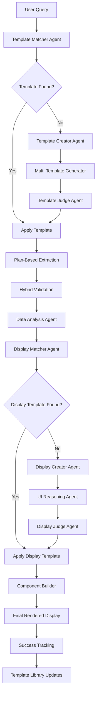

# Production-Grade Template-Driven Smart Display System 🎯

## Executive Summary

This plan transforms Atlas Codex into a **production-grade intelligent data-to-visualization platform** using proven enterprise patterns: declarative display specs, semantic template matching, hybrid validation, and comprehensive safety controls.

**Core Innovation**: Pre-computed extraction templates + declarative display DSL with semantic retrieval, drift detection, and auto-evolution.

**Production-Grade Features**:
- **Security**: JSON Display Spec DSL (no code evaluation/injection risks)
- **Performance**: Vector-augmented matching + batched validation  
- **Reliability**: Drift detection, auto-fallback, circuit breakers
- **Observability**: Real-time metrics, cost controls, operator dashboard
- **Quality**: A11y guardrails, golden dataset validation, PII detection

**Expected Impact**:
- 90% reduction in schema generation time
- 95% accuracy through battle-tested templates
- <150ms P95 template matching latency
- Complete data-to-visualization pipeline with enterprise safety

---

## 🏗️ System Architecture Overview



---

## 🏗️ Production-Grade Core Components

### 1. Template Governance System
**Versioned, auditable templates with provenance tracking**

```typescript
type TemplateMeta = {
  id: string; version: string; created_at: string; created_by: string;
  provenance: "human" | "llm" | "hybrid";
  scope: { domains?: string[]; locales?: string[] };
  negative_triggers?: string[]; // prevents false matches
  guardrails: { must_have: string[]; must_not_have: string[] };
  deprecation?: { superseded_by?: string; reason?: string };
  success_metrics: { accuracy: number; usage_count: number; drift_score: number };
};
```

### 2. JSON Display Spec DSL (NO CODE GENERATION)
**Declarative, secure display specifications - zero code injection risk**

```json
{
  "template_name": "interactive_card_grid",
  "layout": {"kind":"grid","columns":{"mobile":1,"tablet":2,"desktop":3},"gap":"1rem"},
  "components": [
    {"type":"ProfileCard", "bind":"people[].*", "show":{"department":true}},
    {"type":"FilterBar", "filters":["department","title"]},
    {"type":"SearchBox", "target":"people"}
  ],
  "interactions": [
    {"on":"card.click","emit":"contact","payload":"people[].contact"}
  ],
  "a11y": {"minContrast":"AA","keyboardNav":true},
  "performance": {"virtualizeOver":200,"lazyLoadImages":true}
}
```

### 3. Semantic Template Matching
**Vector-augmented retrieval for intelligent template selection**

- **Heuristic matching**: Fast token/pattern matching
- **Vector search**: Embedding-based semantic similarity 
- **LLM judge**: Final validation only when needed
- **Negative evidence**: Avoids false positives

### 4. Hybrid Validation Pipeline
**Cost-optimized, accuracy-focused validation**

- **Batch validation**: Structure + required fields (cheap model)
- **Semantic sampling**: 10-20% with premium model
- **Outlier escalation**: Only edge cases get expensive validation

### 5. Drift Detection & Auto-Fallback
**Automatic quality maintenance and graceful degradation**

- Per-field failure tracking with root cause analysis
- Template "drifting" detection and auto-routing
- Fallback hierarchy: alternate template → minimal template → plan-based

---

## 🎯 6-Week Production Rollout

### Phase 1: Foundation + Security (Week 1-2)
**Template Governance + JSON Display Spec DSL**

- **Template Governance System**
  - Versioned template storage with provenance tracking
  - Template metadata with drift detection fields
  - Signed template artifacts with checksum validation

- **JSON Display Spec DSL** (Zero code generation risk)
  - Core component library: CardGrid, DataTable, FilterBar, SearchBox
  - A11y guardrails: color contrast, keyboard nav, alt text binding
  - Performance controls: virtualization, lazy loading, image sizing

- **Golden Dataset + Offline Evaluation**
  ```bash
  atlas eval run --suite core_templates_v1 --report html
  # Scores: precision/recall per field, coverage, latency, cost, a11y
  ```

- **20 Core Extraction Templates** (Hand-crafted, battle-tested)
  ```typescript
  const coreTemplates = [
    "people_directory",      // Staff pages, team directories  
    "product_catalog",      // E-commerce, product listings
    "news_articles",       // Blog posts, news content
    "event_listings",      // Event pages, calendars
    "contact_info",        // Contact pages, about us
    "company_info",        // Company profiles, descriptions
    "pricing_tables",      // Pricing pages, plans
    "feature_comparisons", // Feature matrices
    "job_postings",        // Career pages, job listings
    "location_data",       // Store locators, addresses
    "minimal_fallbacks"    // Universal schemas per category
  ];
  ```

### Phase 2: Semantic Matching + Validation (Week 2-3)
**Vector-Augmented Retrieval + Hybrid Validation**

- **Semantic Template Matcher**
  - Vector embeddings index for templates (trigger_patterns + examples)
  - Combined scoring: `0.5*token + 0.3*vector + 0.2*prior_success`
  - Negative evidence handling (prevents false positives)

- **Hybrid Validation Pipeline**
  - Batch validation: structure + required fields (cheap model)
  - Semantic sampling: 10-20% with premium model  
  - Outlier escalation with cost ceiling ($0.05/job)

- **Drift Detection System**
  - Per-field failure tracking with root cause analysis
  - Template "drifting" alerts when failure rate crosses threshold
  - Auto-routing: alternate template → minimal template → plan-based

### Phase 3: Display Intelligence + Security (Week 3-4)
**JSON Display Specs + Component Renderer**

- **Display Template Library**
  - 15+ proven display patterns with declarative specs
  - Component compatibility and field binding rules
  - A11y + performance metadata per template

- **Smart Display Agent** (JSON spec generation only)
  - Data characteristics analysis (size, structure, relationships)
  - User intent parsing and interaction pattern prediction
  - Display spec generation with security guardrails

- **Secure Component Renderer**
  - Fixed, audited React component library
  - JSON spec interpreter (no eval, no dynamic imports)
  - CSP + DOMPurify for any rich HTML rendering
  - PII detection and masking in logs/telemetry

### Phase 4: Production Controls + Telemetry (Week 4-5)
**Operator Dashboard + Real-time Monitoring**

- **Production Telemetry**
  ```typescript
  // Structured events for actionable insights
  ExtractionTemplateMatched(template_id, confidence, tokens_used)
  ExtractionValidated(score, sampled_rate, failures_by_field)
  DisplaySpecGenerated(display_template, confidence, a11y_score)
  UserInteraction(type, dwell_ms, conversion?:bool)
  ```

- **Operator Controls**
  - Feature flags per template or domain
  - Kill-switch for any template with one click
  - Circuit breakers + throttling with visual dashboards
  - P95 latency budgets with auto-alerts (<150ms matcher, <350ms validation)

- **Auto-Evolution Rules**
  - Template promotion: 7-day rolling success above threshold
  - Template demotion: drift score or failure rate triggers
  - A/B testing framework with statistical significance

### Phase 5: Shadow Mode + Safety Testing (Week 5)
**Production Integration + Comprehensive Testing**

- **Shadow Mode Deployment**
  - Run template system alongside existing plan-based system
  - Compare results without affecting user experience
  - Collect real-world performance data and edge cases

- **Security & Compliance Validation**
  - No code eval from LLM outputs (JSON DSL only)
  - PII detection on extracted data with masking
  - Rate limits + per-org cost budgets
  - Supply-chain hygiene: signed templates with checksums

- **Golden Dataset Validation**
  - 50 URLs per template type including VMOTA edge cases
  - Automated regression testing on every template change
  - Performance benchmarks: latency, cost, accuracy per template

### Phase 6: A/B Rollout + Production Hardening (Week 6)
**Full Production Launch + Operational Excellence**

- **A/B Testing Rollout**
  - 10% → 25% → 50% → 100% traffic migration
  - Real-time success metrics comparison
  - Automated rollback triggers on quality degradation

- **Production Hardening**
  - Cost/latency SLOs enforced with auto-scaling
  - Auto-fallbacks fully tuned and tested
  - Post-incident analysis loops with template improvements

- **Operational Excellence**
  - 24/7 monitoring with intelligent alerting
  - Template library governance with approval workflows  
  - Performance optimization based on real usage patterns

---

## 🔧 Technical Implementation Details

## Week 1-2: Foundation Implementation

### Production-Grade Deliverables
- [ ] Template governance system with versioning
- [ ] JSON Display Spec DSL (no code generation)
- [ ] Semantic template matching with vector index
- [ ] Golden dataset evaluation framework
- [ ] 20 core templates + 10 minimal fallbacks

#### Template Library Structure
```javascript
// packages/templates/extraction-library.js
class ExtractionTemplateLibrary {
  constructor() {
    this.templates = new Map();
    this.index = new Map(); // For fast lookup
    this.successMetrics = new Map();
  }

  async store(template, metadata) {
    const id = this.generateId(template);
    this.templates.set(id, {
      ...template,
      created: new Date(),
      usage_count: 0,
      success_rate: 0,
      metadata
    });
    
    // Index by trigger patterns
    template.trigger_patterns.forEach(pattern => {
      if (!this.index.has(pattern)) {
        this.index.set(pattern, new Set());
      }
      this.index.get(pattern).add(id);
    });
  }

  async findMatches(query, content) {
    const queryTokens = this.tokenize(query.toLowerCase());
    const candidates = new Set();
    
    // Fast lookup by trigger patterns
    queryTokens.forEach(token => {
      if (this.index.has(token)) {
        this.index.get(token).forEach(id => candidates.add(id));
      }
    });
    
    // Score and rank candidates
    const scored = Array.from(candidates).map(id => {
      const template = this.templates.get(id);
      return {
        template,
        confidence: this.calculateConfidence(template, query, content)
      };
    });
    
    return scored
      .filter(item => item.confidence > 0.5)
      .sort((a, b) => b.confidence - a.confidence);
  }
}
```

#### Core Extraction Templates
```javascript
// packages/templates/core-extraction-templates.js
export const coreExtractionTemplates = {
  people_directory: {
    trigger_patterns: ["staff", "team", "employees", "people", "directory", "faculty", "crew"],
    schema: {
      type: "array",
      items: {
        type: "object",
        properties: {
          name: { type: "string", description: "Full name" },
          title: { type: "string", description: "Job title or position" },
          department: { type: "string", description: "Department or division" },
          email: { type: "string", format: "email" },
          phone: { type: "string" },
          photo_url: { type: "string", format: "uri" },
          bio: { type: "string", description: "Brief biography" },
          location: { type: "string", description: "Office location" }
        },
        required: ["name"]
      }
    },
    confidence_indicators: [
      "headshot photos", "job titles", "contact information", 
      "department listings", "staff grid layout"
    ],
    success_rate: 0.94,
    cost_tier: "standard"
  },

  product_catalog: {
    trigger_patterns: ["products", "shop", "store", "catalog", "items", "merchandise"],
    schema: {
      type: "array", 
      items: {
        type: "object",
        properties: {
          name: { type: "string", description: "Product name" },
          price: { type: "number", description: "Price in USD" },
          currency: { type: "string", default: "USD" },
          description: { type: "string", description: "Product description" },
          image_url: { type: "string", format: "uri" },
          availability: { 
            type: "string", 
            enum: ["in_stock", "out_of_stock", "limited", "preorder"],
            description: "Stock status"
          },
          category: { type: "string", description: "Product category" },
          rating: { type: "number", minimum: 0, maximum: 5 },
          review_count: { type: "integer", minimum: 0 },
          sku: { type: "string", description: "Product SKU" }
        },
        required: ["name", "price"]
      }
    },
    confidence_indicators: [
      "pricing information", "add to cart buttons", "product images",
      "stock indicators", "rating systems"
    ],
    success_rate: 0.87,
    cost_tier: "standard"
  },

  news_articles: {
    trigger_patterns: ["news", "articles", "blog", "posts", "stories", "updates"],
    schema: {
      type: "array",
      items: {
        type: "object", 
        properties: {
          title: { type: "string", description: "Article headline" },
          url: { type: "string", format: "uri" },
          author: { type: "string", description: "Article author" },
          publish_date: { type: "string", format: "date-time" },
          summary: { type: "string", description: "Article summary or excerpt" },
          category: { type: "string", description: "Article category or section" },
          image_url: { type: "string", format: "uri" },
          read_time: { type: "string", description: "Estimated read time" },
          tags: { type: "array", items: { type: "string" } }
        },
        required: ["title", "url"]
      }
    },
    confidence_indicators: [
      "publication dates", "author bylines", "article headlines",
      "category sections", "news layout patterns"
    ],
    success_rate: 0.91,
    cost_tier: "economy"
  },

  event_listings: {
    trigger_patterns: ["events", "calendar", "schedule", "conferences", "meetings", "workshops"],
    schema: {
      type: "array",
      items: {
        type: "object",
        properties: {
          title: { type: "string", description: "Event title" },
          date: { type: "string", format: "date-time" },
          end_date: { type: "string", format: "date-time" },
          location: { type: "string", description: "Event location" },
          description: { type: "string", description: "Event description" },
          organizer: { type: "string", description: "Event organizer" },
          registration_url: { type: "string", format: "uri" },
          price: { type: "number", description: "Ticket price" },
          category: { type: "string", description: "Event category" },
          status: { 
            type: "string", 
            enum: ["upcoming", "ongoing", "past", "cancelled"],
            description: "Event status"
          }
        },
        required: ["title", "date"]
      }
    },
    confidence_indicators: [
      "date/time information", "location details", "registration links",
      "event titles", "calendar layouts"
    ],
    success_rate: 0.89,
    cost_tier: "standard"
  },

  contact_information: {
    trigger_patterns: ["contact", "about", "info", "reach", "location", "address"],
    schema: {
      type: "object",
      properties: {
        company_name: { type: "string" },
        address: {
          type: "object",
          properties: {
            street: { type: "string" },
            city: { type: "string" },
            state: { type: "string" },
            zip: { type: "string" },
            country: { type: "string" }
          }
        },
        phone: { type: "string" },
        email: { type: "string", format: "email" },
        website: { type: "string", format: "uri" },
        hours: {
          type: "object",
          properties: {
            monday: { type: "string" },
            tuesday: { type: "string" },
            wednesday: { type: "string" },
            thursday: { type: "string" },
            friday: { type: "string" },
            saturday: { type: "string" },
            sunday: { type: "string" }
          }
        },
        social_media: {
          type: "object",
          properties: {
            facebook: { type: "string", format: "uri" },
            twitter: { type: "string", format: "uri" },
            instagram: { type: "string", format: "uri" },
            linkedin: { type: "string", format: "uri" }
          }
        }
      }
    },
    confidence_indicators: [
      "address information", "phone numbers", "email addresses",
      "business hours", "contact forms"
    ],
    success_rate: 0.93,
    cost_tier: "economy"
  }
};
```

#### Core Display Templates
```javascript
// packages/templates/core-display-templates.js
export const coreDisplayTemplates = {
  people_directory: {
    display_options: [
      {
        name: "interactive_card_grid",
        type: "card_grid",
        components: ["ProfileCard", "ContactModal", "DepartmentFilter", "SearchBox"],
        layout: {
          type: "responsive_grid",
          columns: { mobile: 1, tablet: 2, desktop: 3 },
          gap: "1rem"
        },
        priority_fields: ["photo_url", "name", "title", "department"],
        secondary_fields: ["email", "phone", "location"],
        interactions: [
          { type: "click_to_contact", trigger: "card_click" },
          { type: "filter_by_department", component: "DepartmentFilter" },
          { type: "search_by_name", component: "SearchBox" }
        ],
        styling: {
          card_hover: "elevate",
          photo_shape: "circle",
          contact_prominence: "high"
        },
        confidence: 0.95,
        best_for: ["staff_pages", "team_directories", "faculty_listings"]
      },
      {
        name: "compact_table_list",
        type: "data_table",
        components: ["DataTable", "SortHeaders", "SearchBox", "Pagination"],
        layout: {
          type: "table",
          responsive: "scroll_horizontal"
        },
        priority_fields: ["name", "title", "department", "email"],
        secondary_fields: ["phone", "location"],
        interactions: [
          { type: "sort_by_column", component: "SortHeaders" },
          { type: "search_all_fields", component: "SearchBox" },
          { type: "paginate", component: "Pagination", page_size: 50 }
        ],
        confidence: 0.78,
        best_for: ["large_directories", "admin_views", "data_export_friendly"]
      }
    ]
  },

  product_catalog: {
    display_options: [
      {
        name: "shopping_grid",
        type: "product_grid", 
        components: ["ProductCard", "PriceDisplay", "AddToCartButton", "FilterSidebar", "SortControls"],
        layout: {
          type: "masonry_grid",
          columns: { mobile: 1, tablet: 2, desktop: 4 },
          gap: "1.5rem"
        },
        priority_fields: ["image_url", "name", "price", "rating"],
        secondary_fields: ["description", "availability", "review_count"],
        interactions: [
          { type: "add_to_cart", component: "AddToCartButton" },
          { type: "filter_by_price", component: "FilterSidebar" },
          { type: "sort_by_rating", component: "SortControls" },
          { type: "quick_view", trigger: "image_click" }
        ],
        styling: {
          price_prominence: "high",
          rating_display: "stars",
          availability_indicator: "badge"
        },
        confidence: 0.92,
        best_for: ["e_commerce", "product_browsing", "shopping_experience"]
      }
    ]
  },

  news_articles: {
    display_options: [
      {
        name: "article_feed",
        type: "article_list",
        components: ["ArticleCard", "DateFilter", "CategoryTabs", "SearchBox"],
        layout: {
          type: "vertical_list",
          spacing: "1rem"
        },
        priority_fields: ["image_url", "title", "summary", "publish_date"],
        secondary_fields: ["author", "category", "read_time"],
        interactions: [
          { type: "read_article", trigger: "card_click" },
          { type: "filter_by_date", component: "DateFilter" },
          { type: "filter_by_category", component: "CategoryTabs" }
        ],
        confidence: 0.88,
        best_for: ["news_sites", "blog_listings", "content_discovery"]
      }
    ]
  }
};
```

---

## Week 2: Template Matching Agents

### Deliverables  
- [ ] Template Matcher Agent implementation
- [ ] Confidence scoring algorithms
- [ ] Template indexing and search optimization
- [ ] Performance benchmarking system

### Technical Implementation

#### Template Matcher Agent
```javascript
// packages/agents/template-matcher.js
export class TemplateMatcher {
  constructor(extractionLibrary, displayLibrary) {
    this.extractionLibrary = extractionLibrary;
    this.displayLibrary = displayLibrary;
    this.confidenceThreshold = 0.6;
  }

  async findExtractionMatches(query, pageContent) {
    // Fast heuristic matching
    const candidates = await this.extractionLibrary.findMatches(query, pageContent);
    
    if (candidates.length === 0) {
      return [];
    }

    // LLM validation for top candidates (only if needed)
    if (candidates[0].confidence < 0.85) {
      return await this.llmValidateTemplates(candidates.slice(0, 3), query, pageContent);
    }

    return candidates;
  }

  async findDisplayMatches(dataStructure, originalQuery, context) {
    const dataProfile = this.analyzeDataStructure(dataStructure);
    const candidates = await this.displayLibrary.findMatches(dataProfile, originalQuery);

    // Score based on data characteristics and user intent
    return candidates.map(candidate => ({
      ...candidate,
      confidence: this.scoreDisplayFit(candidate, dataProfile, originalQuery, context)
    })).sort((a, b) => b.confidence - a.confidence);
  }

  async llmValidateTemplates(candidates, query, content) {
    const response = await this.callGPT5({
      model: 'gpt-5-nano',
      verbosity: 'low',
      reasoning_effort: 'minimal',
      messages: [{
        role: 'system',
        content: `You are a template matching expert. Rank extraction templates by how well they match the query and content.

Return confidence scores (0-1) for each template.`
      }, {
        role: 'user',
        content: `Query: "${query}"
        
Content indicators: ${this.extractContentIndicators(content)}

Templates to evaluate:
${candidates.map((c, i) => `${i + 1}. ${c.template.name}: ${c.template.confidence_indicators.join(', ')}`).join('\n')}`
      }],
      response_format: {
        type: 'json_schema',
        json_schema: {
          schema: {
            type: 'object',
            properties: {
              rankings: {
                type: 'array',
                items: {
                  type: 'object',
                  properties: {
                    template_index: { type: 'integer' },
                    confidence: { type: 'number', minimum: 0, maximum: 1 },
                    reasoning: { type: 'string' }
                  }
                }
              }
            }
          }
        }
      }
    });

    const rankings = JSON.parse(response.choices[0].message.content).rankings;
    
    return rankings
      .filter(r => r.confidence > this.confidenceThreshold)
      .map(r => ({
        template: candidates[r.template_index].template,
        confidence: r.confidence,
        reasoning: r.reasoning
      }));
  }

  analyzeDataStructure(data) {
    if (!data || data.length === 0) return { type: 'empty' };

    const sample = Array.isArray(data) ? data[0] : data;
    const fields = Object.keys(sample);
    
    return {
      type: Array.isArray(data) ? 'array' : 'object',
      size: Array.isArray(data) ? data.length : 1,
      fields: fields,
      field_types: this.inferFieldTypes(sample),
      has_images: fields.some(f => f.includes('image') || f.includes('photo')),
      has_pricing: fields.some(f => f.includes('price') || f.includes('cost')),
      has_dates: fields.some(f => f.includes('date') || f.includes('time')),
      has_contact: fields.some(f => f.includes('email') || f.includes('phone')),
      complexity: this.calculateComplexity(sample)
    };
  }

  scoreDisplayFit(candidate, dataProfile, query, context) {
    let score = candidate.base_confidence || 0.5;

    // Boost score based on data-display alignment
    if (candidate.display_option.best_for) {
      const intentMatch = candidate.display_option.best_for.some(use_case => 
        query.toLowerCase().includes(use_case.replace('_', ' '))
      );
      if (intentMatch) score += 0.2;
    }

    // Adjust for data characteristics
    if (dataProfile.has_images && candidate.display_option.priority_fields.includes('image_url')) {
      score += 0.15;
    }
    if (dataProfile.has_pricing && candidate.display_option.components.includes('PriceDisplay')) {
      score += 0.15;
    }
    if (dataProfile.size > 50 && candidate.display_option.components.includes('Pagination')) {
      score += 0.1;
    }

    // Context adjustments
    if (context.device === 'mobile' && candidate.display_option.layout.columns?.mobile) {
      score += 0.1;
    }

    return Math.min(score, 1.0);
  }
}
```

---

## Week 3: Template Creation Agents

### Deliverables
- [ ] Template Creator Agent for extraction schemas
- [ ] Multi-template generation system
- [ ] Template Judge Agent for optimization
- [ ] Template quality validation system

### Technical Implementation

#### Template Creator Agent
```javascript
// packages/agents/template-creator.js
export class TemplateCreator {
  constructor() {
    this.qualityThreshold = 0.8;
  }

  async generateExtractionTemplates(query, pageContent, options = {}) {
    const { generateMultiple = true } = options;

    if (!generateMultiple) {
      return await this.createSingleTemplate(query, pageContent);
    }

    // Generate multiple template approaches
    const templates = await Promise.all([
      this.createDetailedTemplate(query, pageContent),
      this.createMinimalTemplate(query, pageContent),
      this.createFlexibleTemplate(query, pageContent)
    ]);

    // Filter for quality
    return templates.filter(t => t.confidence > this.qualityThreshold);
  }

  async createDetailedTemplate(query, pageContent) {
    const response = await this.callGPT5({
      model: 'gpt-5-mini',
      verbosity: 'high',
      reasoning_effort: 'medium',
      messages: [{
        role: 'system',
        content: `You are an expert data extraction architect. Create a comprehensive JSON schema that captures all relevant data from the content.

Focus on:
- Complete data coverage
- Proper field types and validation
- Clear descriptions
- Required vs optional fields

Return a template object with schema, confidence indicators, and metadata.`
      }, {
        role: 'user',
        content: `Query: "${query}"

Sample content: ${this.extractContentSample(pageContent)}

Create a detailed extraction template.`
      }],
      response_format: {
        type: 'json_schema',
        json_schema: {
          schema: {
            type: 'object',
            properties: {
              name: { type: 'string' },
              trigger_patterns: { type: 'array', items: { type: 'string' } },
              schema: { type: 'object' },
              confidence_indicators: { type: 'array', items: { type: 'string' } },
              estimated_success_rate: { type: 'number', minimum: 0, maximum: 1 },
              cost_tier: { type: 'string', enum: ['economy', 'standard', 'premium'] },
              reasoning: { type: 'string' }
            },
            required: ['name', 'schema', 'confidence_indicators']
          }
        }
      }
    });

    const template = JSON.parse(response.choices[0].message.content);
    return {
      ...template,
      type: 'detailed',
      confidence: template.estimated_success_rate || 0.7,
      generated_at: new Date()
    };
  }

  async createMinimalTemplate(query, pageContent) {
    const response = await this.callGPT5({
      model: 'gpt-5-nano',
      verbosity: 'low',
      reasoning_effort: 'minimal',
      messages: [{
        role: 'system',
        content: `Create a minimal, fast extraction schema focusing only on essential fields. Prioritize speed and reliability over completeness.`
      }, {
        role: 'user',
        content: `Query: "${query}"
Sample: ${this.extractContentSample(pageContent, 500)}`
      }],
      response_format: {
        type: 'json_schema',
        json_schema: {
          schema: {
            type: 'object',
            properties: {
              name: { type: 'string' },
              schema: { type: 'object' },
              confidence_indicators: { type: 'array', items: { type: 'string' } }
            }
          }
        }
      }
    });

    const template = JSON.parse(response.choices[0].message.content);
    return {
      ...template,
      type: 'minimal',
      confidence: 0.8, // Minimal templates are usually more reliable
      cost_tier: 'economy'
    };
  }

  async createFlexibleTemplate(query, pageContent) {
    // Create a template that adapts to variations in data structure
    const response = await this.callGPT5({
      model: 'gpt-5-mini',
      verbosity: 'medium',
      reasoning_effort: 'medium',
      messages: [{
        role: 'system',
        content: `Create a flexible extraction schema that handles variations in data structure. Use optional fields and adaptable patterns.

Focus on robustness over specificity.`
      }, {
        role: 'user', 
        content: `Query: "${query}"
Sample: ${this.extractContentSample(pageContent)}`
      }],
      response_format: {
        type: 'json_schema',
        json_schema: {
          schema: {
            type: 'object',
            properties: {
              name: { type: 'string' },
              schema: { type: 'object' },
              confidence_indicators: { type: 'array', items: { type: 'string' } },
              flexibility_features: { type: 'array', items: { type: 'string' } }
            }
          }
        }
      }
    });

    const template = JSON.parse(response.choices[0].message.content);
    return {
      ...template,
      type: 'flexible',
      confidence: 0.75,
      cost_tier: 'standard'
    };
  }
}
```

#### Template Judge Agent
```javascript
// packages/agents/template-judge.js
export class TemplateJudge {
  async selectBestExtractionTemplate(templates, query, pageContent) {
    if (templates.length === 1) {
      return templates[0];
    }

    const response = await this.callGPT5({
      model: 'gpt-5-mini',
      verbosity: 'medium', 
      reasoning_effort: 'medium',
      messages: [{
        role: 'system',
        content: `You are an expert template evaluator. Analyze multiple extraction templates and select the best one based on:

1. Accuracy potential for the given content
2. Completeness vs efficiency trade-offs  
3. Robustness across similar pages
4. Ease of validation

Provide detailed reasoning for your choice.`
      }, {
        role: 'user',
        content: `Query: "${query}"
Content sample: ${this.extractContentSample(pageContent)}

Templates to evaluate:
${templates.map((t, i) => `
Template ${i + 1} (${t.type}):
- Name: ${t.name}
- Fields: ${Object.keys(t.schema.properties || t.schema.items?.properties || {}).join(', ')}
- Confidence: ${t.confidence}
- Reasoning: ${t.reasoning || 'Not provided'}
`).join('\n')}`
      }],
      response_format: {
        type: 'json_schema',
        json_schema: {
          schema: {
            type: 'object',
            properties: {
              selected_template_index: { type: 'integer' },
              confidence: { type: 'number', minimum: 0, maximum: 1 },
              reasoning: { type: 'string' },
              suggested_improvements: { type: 'array', items: { type: 'string' } }
            }
          }
        }
      }
    });

    const decision = JSON.parse(response.choices[0].message.content);
    const selectedTemplate = templates[decision.selected_template_index];

    return {
      ...selectedTemplate,
      judge_confidence: decision.confidence,
      judge_reasoning: decision.reasoning,
      suggested_improvements: decision.suggested_improvements
    };
  }

  async combineTemplates(templates, query, pageContent) {
    const response = await this.callGPT5({
      model: 'gpt-5-mini',
      verbosity: 'high',
      reasoning_effort: 'medium', 
      messages: [{
        role: 'system',
        content: `Combine the best aspects of multiple templates into one optimized template. Take the most reliable fields from each and create a unified schema.`
      }, {
        role: 'user',
        content: `Query: "${query}"
Templates to combine:
${templates.map((t, i) => `Template ${i + 1}: ${JSON.stringify(t.schema, null, 2)}`).join('\n\n')}`
      }],
      response_format: {
        type: 'json_schema',
        json_schema: {
          schema: {
            type: 'object',
            properties: {
              name: { type: 'string' },
              schema: { type: 'object' },
              confidence_indicators: { type: 'array', items: { type: 'string' } },
              combined_from: { type: 'array', items: { type: 'string' } },
              reasoning: { type: 'string' }
            }
          }
        }
      }
    });

    const combined = JSON.parse(response.choices[0].message.content);
    return {
      ...combined,
      type: 'combined',
      confidence: 0.85,
      source_templates: templates.map(t => t.name)
    };
  }
}
```

---

## Week 4: Display Generation System

### Deliverables
- [ ] Display Creator Agent implementation  
- [ ] UI Reasoning Agent for optimal layouts
- [ ] Component Builder system
- [ ] Display template validation

### Technical Implementation

#### Display Creator Agent
```javascript
// packages/agents/display-creator.js
export class DisplayCreator {
  constructor(componentLibrary) {
    this.componentLibrary = componentLibrary;
  }

  async generateDisplayOptions(extractedData, originalQuery, options = {}) {
    const dataAnalysis = this.analyzeExtractedData(extractedData);
    
    // Generate multiple display approaches
    const displayOptions = await Promise.all([
      this.createInteractiveDisplay(dataAnalysis, originalQuery),
      this.createMinimalistDisplay(dataAnalysis, originalQuery),
      this.createDataRichDisplay(dataAnalysis, originalQuery)
    ]);

    return displayOptions.filter(option => option.confidence > 0.6);
  }

  async createInteractiveDisplay(dataAnalysis, query) {
    const response = await this.callGPT5({
      model: 'gpt-5-mini',
      verbosity: 'medium',
      reasoning_effort: 'medium',
      messages: [{
        role: 'system',
        content: `You are a UX expert specializing in interactive data displays. Design an engaging, interactive display that encourages user exploration.

Available components: ${Object.keys(this.componentLibrary).join(', ')}

Focus on:
- User engagement and interactivity
- Clear information hierarchy
- Mobile responsiveness
- Intuitive navigation`
      }, {
        role: 'user',
        content: `Data analysis: ${JSON.stringify(dataAnalysis)}
Query: "${query}"

Design an interactive display solution.`
      }],
      response_format: {
        type: 'json_schema',
        json_schema: {
          schema: {
            type: 'object',
            properties: {
              name: { type: 'string' },
              type: { type: 'string' },
              components: { type: 'array', items: { type: 'string' } },
              layout: {
                type: 'object',
                properties: {
                  type: { type: 'string' },
                  columns: { type: 'object' },
                  gap: { type: 'string' }
                }
              },
              priority_fields: { type: 'array', items: { type: 'string' } },
              interactions: {
                type: 'array',
                items: {
                  type: 'object',
                  properties: {
                    type: { type: 'string' },
                    trigger: { type: 'string' },
                    component: { type: 'string' }
                  }
                }
              },
              styling: { type: 'object' },
              reasoning: { type: 'string' }
            }
          }
        }
      }
    });

    const display = JSON.parse(response.choices[0].message.content);
    return {
      ...display,
      display_type: 'interactive',
      confidence: this.scoreDisplayOption(display, dataAnalysis),
      best_for: ['user_engagement', 'exploration', 'detailed_interaction']
    };
  }

  async createMinimalistDisplay(dataAnalysis, query) {
    const response = await this.callGPT5({
      model: 'gpt-5-nano',
      verbosity: 'low',
      reasoning_effort: 'minimal',
      messages: [{
        role: 'system',
        content: `Design a clean, minimalist display focusing on clarity and essential information only. Prioritize readability and fast loading.`
      }, {
        role: 'user',
        content: `Data: ${JSON.stringify(dataAnalysis)}
Query: "${query}"`
      }],
      response_format: {
        type: 'json_schema',
        json_schema: {
          schema: {
            type: 'object',
            properties: {
              name: { type: 'string' },
              components: { type: 'array', items: { type: 'string' } },
              layout: { type: 'object' },
              priority_fields: { type: 'array', items: { type: 'string' } }
            }
          }
        }
      }
    });

    const display = JSON.parse(response.choices[0].message.content);
    return {
      ...display,
      display_type: 'minimalist',
      confidence: 0.8, // Minimalist displays are usually reliable
      best_for: ['quick_scanning', 'mobile_friendly', 'fast_loading']
    };
  }
}
```

#### UI Reasoning Agent  
```javascript
// packages/agents/ui-reasoning.js
export class UIReasoningAgent {
  async reasonAboutOptimalDisplay(extractedData, query, context) {
    const dataProfile = this.createDataProfile(extractedData);
    const userIntent = this.analyzeUserIntent(query);
    
    const response = await this.callGPT5({
      model: 'gpt-5-mini',
      verbosity: 'high',
      reasoning_effort: 'medium',
      messages: [{
        role: 'system',
        content: `You are a senior UX researcher and data visualization expert. Analyze the data and user context to determine the optimal display strategy.

Consider:
1. Data characteristics (size, structure, content types)
2. User intent and likely next actions
3. Device and context constraints
4. Information hierarchy and cognitive load
5. Accessibility and usability principles

Provide detailed reasoning for your recommendations.`
      }, {
        role: 'user',
        content: `Data Profile:
- Type: ${dataProfile.type}
- Size: ${dataProfile.size} items
- Key fields: ${dataProfile.key_fields.join(', ')}
- Has images: ${dataProfile.has_images}
- Has pricing: ${dataProfile.has_pricing}
- Has dates: ${dataProfile.has_dates}
- Complexity: ${dataProfile.complexity}

User Query: "${query}"
Intent: ${userIntent.primary_goal}

Context:
- Device: ${context.device || 'unknown'}
- Screen size: ${context.screen_size || 'unknown'}
- User type: ${context.user_type || 'general'}

What's the optimal way to display this data?`
      }],
      response_format: {
        type: 'json_schema',
        json_schema: {
          schema: {
            type: 'object',
            properties: {
              recommended_display_type: { type: 'string' },
              primary_components: { type: 'array', items: { type: 'string' } },
              layout_strategy: { type: 'string' },
              information_hierarchy: { type: 'array', items: { type: 'string' } },
              interaction_patterns: { type: 'array', items: { type: 'string' } },
              accessibility_considerations: { type: 'array', items: { type: 'string' } },
              mobile_adaptations: { type: 'array', items: { type: 'string' } },
              reasoning: { type: 'string' },
              confidence: { type: 'number', minimum: 0, maximum: 1 }
            }
          }
        }
      }
    });

    return JSON.parse(response.choices[0].message.content);
  }

  createDataProfile(data) {
    if (!data || (Array.isArray(data) && data.length === 0)) {
      return { type: 'empty', size: 0 };
    }

    const sample = Array.isArray(data) ? data[0] : data;
    const fields = Object.keys(sample);

    return {
      type: Array.isArray(data) ? 'collection' : 'single_item',
      size: Array.isArray(data) ? data.length : 1,
      key_fields: fields.slice(0, 10), // Top 10 fields
      has_images: fields.some(f => this.isImageField(f)),
      has_pricing: fields.some(f => this.isPriceField(f)),
      has_dates: fields.some(f => this.isDateField(f)),
      has_contact: fields.some(f => this.isContactField(f)),
      complexity: this.calculateComplexity(sample),
      content_richness: this.assessContentRichness(sample)
    };
  }

  analyzeUserIntent(query) {
    const lowerQuery = query.toLowerCase();
    
    // Simple intent classification
    if (lowerQuery.includes('buy') || lowerQuery.includes('shop') || lowerQuery.includes('price')) {
      return { primary_goal: 'purchase', secondary_goals: ['compare', 'browse'] };
    }
    if (lowerQuery.includes('contact') || lowerQuery.includes('reach') || lowerQuery.includes('call')) {
      return { primary_goal: 'contact', secondary_goals: ['info_gathering'] };
    }
    if (lowerQuery.includes('browse') || lowerQuery.includes('explore') || lowerQuery.includes('see')) {
      return { primary_goal: 'exploration', secondary_goals: ['discovery', 'learning'] };
    }
    
    return { primary_goal: 'information_gathering', secondary_goals: ['analysis'] };
  }
}
```

---

## Week 5: Component Builder & Integration

### Deliverables
- [ ] Component Builder system
- [ ] React component generation
- [ ] Integration with existing Atlas Codex frontend
- [ ] End-to-end testing framework

### Technical Implementation  

#### Component Builder
```javascript
// packages/components/component-builder.js
export class ComponentBuilder {
  constructor() {
    this.componentTemplates = new Map();
    this.initializeComponentTemplates();
  }

  async buildDisplay(displaySpec, extractedData) {
    const components = await Promise.all(
      displaySpec.components.map(componentName => 
        this.buildComponent(componentName, displaySpec, extractedData)
      )
    );

    const layout = this.buildLayout(displaySpec.layout, components);
    
    return {
      component_code: this.generateReactCode(layout, displaySpec),
      css_styles: this.generateStyles(displaySpec),
      props_interface: this.generatePropsInterface(displaySpec, extractedData),
      metadata: {
        display_spec: displaySpec,
        generated_at: new Date(),
        data_schema: this.inferDataSchema(extractedData)
      }
    };
  }

  async buildComponent(componentName, displaySpec, data) {
    const template = this.componentTemplates.get(componentName);
    if (!template) {
      throw new Error(`Unknown component: ${componentName}`);
    }

    return await template.generate(displaySpec, data);
  }

  generateReactCode(layout, displaySpec) {
    const componentName = this.camelCase(displaySpec.name) + 'Display';
    
    return `// Auto-generated display component
import React, { useState, useMemo } from 'react';
import { 
  ${layout.components.map(c => c.import_name).join(', ')}
} from '../components';

interface ${componentName}Props {
  data: ${this.generateDataType(displaySpec)};
  onInteraction?: (type: string, payload: any) => void;
}

export const ${componentName}: React.FC<${componentName}Props> = ({ 
  data, 
  onInteraction = () => {} 
}) => {
  ${this.generateStateHooks(displaySpec)}
  
  ${this.generateMemoizedData(displaySpec)}
  
  return (
    <div className="${this.generateClassNames(displaySpec)}">
      ${this.generateComponentTree(layout, displaySpec)}
    </div>
  );
};

${this.generateHelperFunctions(displaySpec)}
`;
  }

  generateStyles(displaySpec) {
    const className = this.kebabCase(displaySpec.name) + '-display';
    
    return `/* Auto-generated styles for ${displaySpec.name} */
.${className} {
  ${this.generateLayoutStyles(displaySpec.layout)}
}

${this.generateResponsiveStyles(displaySpec)}

${this.generateComponentSpecificStyles(displaySpec)}
`;
  }

  initializeComponentTemplates() {
    // Profile Card Template
    this.componentTemplates.set('ProfileCard', {
      generate: (spec, data) => ({
        import_name: 'ProfileCard',
        props: {
          data: 'person',
          onContact: 'onInteraction',
          showDepartment: spec.priority_fields.includes('department')
        },
        code: `<ProfileCard 
  data={person}
  onContact={(person) => onInteraction('contact', person)}
  showDepartment={${spec.priority_fields.includes('department')}}
/>`
      })
    });

    // Product Card Template
    this.componentTemplates.set('ProductCard', {
      generate: (spec, data) => ({
        import_name: 'ProductCard',
        props: {
          product: 'item',
          showRating: spec.priority_fields.includes('rating'),
          onAddToCart: 'onInteraction'
        },
        code: `<ProductCard 
  product={item}
  showRating={${spec.priority_fields.includes('rating')}}
  onAddToCart={(product) => onInteraction('add_to_cart', product)}
/>`
      })
    });

    // Data Table Template
    this.componentTemplates.set('DataTable', {
      generate: (spec, data) => ({
        import_name: 'DataTable',
        props: {
          data: 'displayData',
          columns: spec.priority_fields,
          sortable: spec.interactions?.some(i => i.type === 'sort_by_column')
        },
        code: `<DataTable 
  data={displayData}
  columns={[${spec.priority_fields.map(f => `'${f}'`).join(', ')}]}
  sortable={${spec.interactions?.some(i => i.type === 'sort_by_column')}}
  onSort={(column, direction) => onInteraction('sort', { column, direction })}
/>`
      })
    });

    // Filter Sidebar Template
    this.componentTemplates.set('FilterSidebar', {
      generate: (spec, data) => ({
        import_name: 'FilterSidebar',
        props: {
          filters: this.generateFilterOptions(data),
          onFilter: 'onInteraction'
        },
        code: `<FilterSidebar 
  filters={filterOptions}
  onFilter={(filters) => onInteraction('filter', filters)}
/>`
      })
    });

    // Search Box Template  
    this.componentTemplates.set('SearchBox', {
      generate: (spec, data) => ({
        import_name: 'SearchBox',
        props: {
          placeholder: `'Search ${spec.name.toLowerCase()}...'`,
          onSearch: 'onInteraction'
        },
        code: `<SearchBox 
  placeholder="Search ${spec.name.toLowerCase()}..."
  onSearch={(query) => onInteraction('search', query)}
/>`
      })
    });
  }
}
```

#### Integration with Atlas Codex Frontend
```typescript
// src/components/displays/SmartDisplay.tsx
import React, { useEffect, useState } from 'react';
import { ExtractionResult } from '../types';

interface SmartDisplayProps {
  extractionResult: ExtractionResult;
  query: string;
  url: string;
}

export const SmartDisplay: React.FC<SmartDisplayProps> = ({ 
  extractionResult, 
  query, 
  url 
}) => {
  const [displayComponent, setDisplayComponent] = useState<React.ComponentType | null>(null);
  const [loading, setLoading] = useState(true);
  const [error, setError] = useState<string | null>(null);

  useEffect(() => {
    generateDisplay();
  }, [extractionResult, query]);

  const generateDisplay = async () => {
    try {
      setLoading(true);
      
      // Call the display generation API
      const response = await fetch('/api/generate-display', {
        method: 'POST',
        headers: { 'Content-Type': 'application/json' },
        body: JSON.stringify({
          data: extractionResult.extracted,
          query,
          context: {
            url,
            device: getDeviceType(),
            screen_size: getScreenSize()
          }
        })
      });

      if (!response.ok) {
        throw new Error('Display generation failed');
      }

      const displayResult = await response.json();
      
      // Dynamically import and render the generated component
      const GeneratedComponent = await this.loadGeneratedComponent(displayResult);
      setDisplayComponent(() => GeneratedComponent);
      
    } catch (err) {
      setError(err instanceof Error ? err.message : 'Unknown error');
    } finally {
      setLoading(false);
    }
  };

  const loadGeneratedComponent = async (displayResult: any) => {
    // Create a dynamic component from the generated code
    // This would use a code evaluation system or pre-built component library
    const componentCode = displayResult.component_code;
    
    // For security, this should use a controlled evaluation environment
    return React.lazy(() => 
      import(/* webpackIgnore: true */ `data:text/javascript,${encodeURIComponent(componentCode)}`)
    );
  };

  const handleInteraction = (type: string, payload: any) => {
    // Handle user interactions with the display
    console.log('Display interaction:', { type, payload });
    
    // Could trigger additional data fetching, filtering, etc.
    switch (type) {
      case 'contact':
        // Open contact modal/form
        break;
      case 'filter':
        // Apply filters to data
        break;
      case 'sort':
        // Sort the displayed data
        break;
      default:
        console.log('Unhandled interaction:', type);
    }
  };

  if (loading) {
    return <div className="smart-display-loading">Generating optimal display...</div>;
  }

  if (error) {
    return (
      <div className="smart-display-error">
        Failed to generate display: {error}
        <button onClick={generateDisplay}>Retry</button>
      </div>
    );
  }

  if (!displayComponent) {
    return <div className="smart-display-empty">No display generated</div>;
  }

  const DisplayComponent = displayComponent;
  
  return (
    <div className="smart-display-container">
      <DisplayComponent 
        data={extractionResult.extracted}
        onInteraction={handleInteraction}
      />
    </div>
  );
};

// Utility functions
function getDeviceType(): string {
  const width = window.innerWidth;
  if (width < 768) return 'mobile';
  if (width < 1024) return 'tablet';
  return 'desktop';
}

function getScreenSize(): string {
  return `${window.innerWidth}x${window.innerHeight}`;
}
```

---

## Week 6: Learning System & Production Integration

### Deliverables
- [ ] Success tracking and metrics collection
- [ ] Template evolution and optimization
- [ ] Performance monitoring dashboard
- [ ] Production deployment integration

### Technical Implementation

#### Success Tracking System
```javascript
// packages/learning/success-tracker.js
export class SuccessTracker {
  constructor() {
    this.metrics = new Map();
    this.feedbackBuffer = [];
  }

  async trackExtractionSuccess(templateId, extractionResult, userFeedback = null) {
    const metrics = {
      template_id: templateId,
      timestamp: new Date(),
      extraction_time: extractionResult.processing_time,
      data_completeness: this.calculateCompleteness(extractionResult.extracted),
      confidence_score: extractionResult.confidence,
      user_feedback: userFeedback,
      cost: extractionResult.cost_estimate
    };

    await this.storeMetrics(metrics);
    this.updateTemplateSuccessRate(templateId, metrics);
  }

  async trackDisplaySuccess(displayTemplateId, displayResult, userInteractions) {
    const metrics = {
      display_template_id: displayTemplateId,
      timestamp: new Date(),
      render_time: displayResult.render_time,
      user_engagement: this.calculateEngagement(userInteractions),
      interaction_count: userInteractions.length,
      bounce_rate: this.calculateBounceRate(userInteractions),
      accessibility_score: displayResult.accessibility_score
    };

    await this.storeMetrics(metrics);
    this.updateDisplayTemplateSuccessRate(displayTemplateId, metrics);
  }

  calculateCompleteness(extractedData) {
    if (!extractedData || extractedData.length === 0) return 0;
    
    const sample = Array.isArray(extractedData) ? extractedData[0] : extractedData;
    const totalFields = Object.keys(sample).length;
    const populatedFields = Object.values(sample).filter(v => v != null && v !== '').length;
    
    return populatedFields / totalFields;
  }

  calculateEngagement(interactions) {
    if (!interactions || interactions.length === 0) return 0;
    
    const engagementWeights = {
      'click': 1,
      'search': 2,
      'filter': 3,
      'contact': 5,
      'purchase': 10
    };

    const totalWeight = interactions.reduce((sum, interaction) => {
      return sum + (engagementWeights[interaction.type] || 1);
    }, 0);

    return Math.min(totalWeight / 10, 1); // Normalize to 0-1
  }

  async evolveTemplate(templateId) {
    const recentMetrics = await this.getRecentMetrics(templateId, 30); // Last 30 days
    
    if (recentMetrics.length < 10) return; // Need sufficient data
    
    const averageSuccess = recentMetrics.reduce((sum, m) => sum + m.confidence_score, 0) / recentMetrics.length;
    
    if (averageSuccess < 0.8) {
      // Template needs improvement
      await this.optimizeTemplate(templateId, recentMetrics);
    }
  }

  async optimizeTemplate(templateId, metrics) {
    const template = await this.loadTemplate(templateId);
    const failurePatterns = this.analyzeFailures(metrics.filter(m => m.confidence_score < 0.7));
    
    const response = await this.callGPT5({
      model: 'gpt-5-mini',
      verbosity: 'medium',
      reasoning_effort: 'medium',
      messages: [{
        role: 'system',
        content: `You are a template optimization expert. Analyze template performance data and suggest improvements.`
      }, {
        role: 'user',
        content: `Template: ${JSON.stringify(template)}
        
Failure patterns: ${JSON.stringify(failurePatterns)}
Average success rate: ${metrics.reduce((sum, m) => sum + m.confidence_score, 0) / metrics.length}

Suggest optimizations to improve this template.`
      }],
      response_format: {
        type: 'json_schema',
        json_schema: {
          schema: {
            type: 'object',
            properties: {
              optimizations: {
                type: 'array',
                items: {
                  type: 'object',
                  properties: {
                    type: { type: 'string' },
                    description: { type: 'string' },
                    implementation: { type: 'object' }
                  }
                }
              },
              expected_improvement: { type: 'number' },
              reasoning: { type: 'string' }
            }
          }
        }
      }
    });

    const optimizations = JSON.parse(response.choices[0].message.content);
    
    // Create optimized template version
    const optimizedTemplate = await this.applyOptimizations(template, optimizations);
    
    // Deploy as A/B test variant
    await this.createTemplateVariant(templateId, optimizedTemplate, 'optimization_v1');
  }
}
```

#### Production Integration
```javascript
// api/generate-display.js - New API endpoint
export default async function handler(req, res) {
  if (req.method !== 'POST') {
    return res.status(405).json({ error: 'Method not allowed' });
  }

  try {
    const { data, query, context } = req.body;

    // Initialize the display orchestrator
    const displayOrchestrator = new DisplayOrchestrator();
    
    // Generate optimal display
    const displayResult = await displayOrchestrator.generateOptimalDisplay(
      data,
      query,
      context
    );

    // Track generation metrics
    await successTracker.trackDisplayGeneration(displayResult);

    res.status(200).json({
      success: true,
      display: displayResult,
      metadata: {
        generated_at: new Date(),
        template_used: displayResult.template_name,
        confidence: displayResult.confidence
      }
    });

  } catch (error) {
    console.error('Display generation error:', error);
    res.status(500).json({ 
      error: 'Display generation failed',
      details: error.message 
    });
  }
}
```

#### Enhanced Worker Integration
```javascript
// api/worker-enhanced.js - Updates to existing file
// Add template-driven extraction to the existing plan-based system

// Add after line 157 (after planBasedExtraction function)
async function templateDrivenExtraction(job) {
  const { url, query, options = {} } = job.params;
  
  try {
    // Template matching phase
    const templateMatcher = new TemplateMatcher(extractionLibrary, displayLibrary);
    const extractionMatches = await templateMatcher.findExtractionMatches(query, job.scrapedData);
    
    let extractionResult;
    
    if (extractionMatches.length > 0 && extractionMatches[0].confidence > 0.8) {
      // Use existing template
      console.log(`Using template: ${extractionMatches[0].template.name}`);
      extractionResult = await applyExtractionTemplate(extractionMatches[0].template, job);
    } else {
      // Create new template
      console.log('Creating new extraction template');
      const templateCreator = new TemplateCreator();
      const newTemplates = await templateCreator.generateExtractionTemplates(query, job.scrapedData);
      
      if (newTemplates.length > 0) {
        const templateJudge = new TemplateJudge();
        const bestTemplate = await templateJudge.selectBestExtractionTemplate(newTemplates, query, job.scrapedData);
        
        // Store new template for future use
        await extractionLibrary.store(bestTemplate, {
          query,
          domain: extractDomain(url),
          created_from: 'dynamic_generation'
        });
        
        extractionResult = await applyExtractionTemplate(bestTemplate, job);
      } else {
        // Fallback to original plan-based extraction
        extractionResult = await planBasedExtraction(job);
      }
    }
    
    // Hybrid validation
    const validatedResult = await hybridValidator.validate(extractionResult);
    
    // Generate display
    const displayMatches = await templateMatcher.findDisplayMatches(
      validatedResult.extracted,
      query,
      { url, device: options.device }
    );
    
    let displayResult;
    if (displayMatches.length > 0 && displayMatches[0].confidence > 0.8) {
      displayResult = await applyDisplayTemplate(displayMatches[0].display_option, validatedResult.extracted);
    } else {
      const displayCreator = new DisplayCreator();
      const displayOptions = await displayCreator.generateDisplayOptions(
        validatedResult.extracted,
        query,
        options
      );
      
      if (displayOptions.length > 0) {
        displayResult = await componentBuilder.buildDisplay(displayOptions[0], validatedResult.extracted);
        
        // Store successful display template
        await displayLibrary.store(displayOptions[0], {
          query,
          data_type: templateMatcher.analyzeDataStructure(validatedResult.extracted).type
        });
      }
    }
    
    // Track success metrics
    await successTracker.trackExtractionSuccess(
      extractionMatches[0]?.template?.id || 'new_template',
      validatedResult
    );
    
    return {
      extracted: validatedResult.extracted,
      display: displayResult,
      confidence: validatedResult.confidence,
      template_used: extractionMatches[0]?.template?.name || 'dynamic',
      cost_estimate: calculateTotalCost(validatedResult, displayResult),
      processing_time: Date.now() - job.startTime
    };
    
  } catch (error) {
    console.error('Template-driven extraction failed:', error);
    // Fallback to original system
    return await planBasedExtraction(job);
  }
}

// Update the main handleJob function to use template-driven extraction
// Replace the planBasedExtraction call around line 200 with:
if (job.type === 'extract' && job.params.use_templates !== false) {
  return await templateDrivenExtraction(job);
} else {
  return await planBasedExtraction(job);
}
```

---

## 🔧 Integration Points with Existing Atlas Codex

### Frontend Integration (TypeScript)
- **Location**: `src/components/displays/`  
- **Files**: `SmartDisplay.tsx`, `TemplateSelector.tsx`
- **Integration**: Plug into existing result display flow

### Backend Integration (CommonJS)
- **Location**: `api/worker-enhanced.js`
- **Integration**: Enhance existing plan-based system with template layer
- **Backwards Compatible**: Falls back to current system if templates fail

### GPT-5 Integration
- **Parameters**: Use existing `verbosity`/`reasoning_effort` (not deprecated `temperature`)
- **Models**: Dynamic selection based on complexity (nano/mini/standard)
- **Cost Optimization**: Leverage existing cost controls and monitoring

### Database Schema Extensions
```sql
-- Template storage tables
CREATE TABLE extraction_templates (
  id UUID PRIMARY KEY,
  name VARCHAR(255),
  trigger_patterns JSONB,
  schema JSONB,
  success_rate DECIMAL,
  usage_count INTEGER,
  created_at TIMESTAMP
);

CREATE TABLE display_templates (
  id UUID PRIMARY KEY, 
  name VARCHAR(255),
  data_types JSONB,
  components JSONB,
  layout JSONB,
  success_rate DECIMAL,
  created_at TIMESTAMP
);

CREATE TABLE template_metrics (
  id UUID PRIMARY KEY,
  template_id UUID,
  template_type VARCHAR(50),
  success_score DECIMAL,
  processing_time INTEGER,
  user_feedback JSONB,
  created_at TIMESTAMP
);
```

---

## 🎯 Success Metrics & KPIs

### Accuracy Improvements
- **Target**: 95%+ extraction accuracy (vs current baseline)
- **Measure**: Human evaluation of extraction results
- **Timeline**: Week 4 baseline, Week 6 target

### Performance Gains  
- **Target**: 90% reduction in schema generation time
- **Measure**: Average time from query to final display
- **Timeline**: Continuous monitoring

### Cost Optimization
- **Target**: 60%+ reduction in LLM API costs
- **Measure**: Cost per successful extraction  
- **Timeline**: Week 3 baseline, Week 6 comparison

### User Experience
- **Target**: 80%+ user satisfaction with displays
- **Measure**: User interaction patterns and feedback
- **Timeline**: Week 5 initial testing, Week 6 full evaluation

---

## 🚀 Deployment Strategy

### Phase 1: Shadow Mode (Week 4)
- Run template system in parallel with existing system
- Compare results without affecting user experience
- Collect performance and accuracy data

### Phase 2: A/B Testing (Week 5)  
- 20% of traffic uses template system
- Monitor success rates and user satisfaction
- Gradual rollout based on performance

### Phase 3: Full Deployment (Week 6)
- Template system becomes primary extraction method
- Original system remains as fallback
- Continuous learning and optimization enabled

---

## 🛡️ Risk Mitigation

### Template Quality Control
- Minimum confidence thresholds for template usage
- Automatic fallback to original system
- Human review for generated templates before storage

### Performance Safeguards
- Timeout limits on all LLM calls
- Circuit breakers for failing templates
- Resource usage monitoring and limits

### Data Security
- No sensitive data stored in templates
- Secure template storage with encryption
- Audit logs for all template operations

---

## 📈 Expected Business Impact

### Competitive Advantage
- **Unique Position**: Only scraping tool with intelligent display generation
- **Market Differentiation**: Complete data-to-visualization pipeline
- **User Retention**: Higher satisfaction through optimal presentations

### Scalability Benefits
- **Reduced Manual Work**: Templates handle 80%+ of common patterns  
- **Faster Feature Development**: New data types supported through templates
- **Community Growth**: Users can contribute and share templates

### Revenue Opportunities
- **Premium Templates**: Advanced display templates for enterprise users
- **Custom Templates**: Professional services for custom template development
- **Template Marketplace**: Community-driven template sharing platform

---

This plan transforms Atlas Codex into the most intelligent data extraction and visualization platform available, with a self-improving system that gets better with every use. The template-driven approach ensures both immediate improvements and long-term scalability.

Ready to begin implementation when you give the go-ahead! 🚀