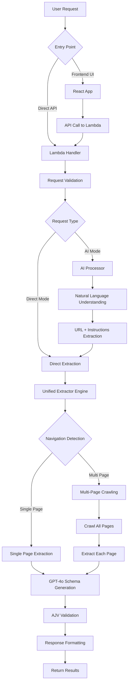

# Atlas Codex Critical Path Documentation

This document outlines the critical path for Atlas Codex's navigation-enhanced unified extraction system, providing developers with a clear understanding of how requests flow through the system and where key decisions are made.

## 🎯 System Overview

Atlas Codex uses a **navigation-enhanced unified extractor** that intelligently determines whether to perform single-page or multi-page extraction based on request analysis and content patterns.

## 🔄 Request Flow Diagram



## 📁 Critical Files and Functions

### 1. **Entry Point**: `api/lambda.js`
**Function**: `exports.handler()`
- **Purpose**: Main Lambda handler, request routing
- **Key Decisions**: Route to AI processing vs direct extraction
- **Critical Code**:
```javascript
// AI Processing endpoint
if (path === '/api/ai/process' || path === '/dev/api/ai/process') {
  // Route to AI processor with autoExecute
}

// Direct extraction endpoint
if (path.includes('/api/extract')) {
  return await handleExtract(method, body, headers);
}
```

### 2. **AI Processing**: `api/atlas-generator-integration.js`
**Function**: `processNaturalLanguage()`
- **Purpose**: Convert natural language to extraction parameters
- **Key Decisions**: URL extraction, instruction parsing
- **Critical Code**:
```javascript
const aiResult = await processNaturalLanguage(params.prompt, {
  apiKey: params.apiKey || headers['x-openai-key']
});
```

### 3. **Core Engine**: `api/evidence-first-bridge.js`
**Main Function**: `processWithUnifiedExtractor()`

#### 3a. **Navigation Detection**: `shouldUseMultiPageExtraction()`
- **Purpose**: Decide if multi-page extraction is needed
- **Key Logic**:
```javascript
// Explicit keywords check
const explicitKeywords = ['all pages', 'entire site', 'crawl', 'comprehensive'];

// Pagination indicators detection  
const paginationIndicators = ['page 2', 'next page', 'more results'];

// Limited results patterns
const limitedResultsPatterns = [/showing \d+ of \d+/i, /view all \d+/i];
```

#### 3b. **Single Page Path**: `performSinglePageExtraction()`
- **Purpose**: Extract from single page using AI
- **Key Steps**:
  1. Quick fix detection (departments, etc.)
  2. HTML cleaning for AI processing
  3. GPT-4o unified extraction
  4. AJV validation

#### 3c. **Multi-Page Path**: `performNavigationAwareExtraction()`
- **Purpose**: Crawl multiple pages and extract from each
- **Key Steps**:
  1. Generate crawl job ID
  2. Configure crawling scope
  3. Use `performCrawl()` from worker-enhanced.js
  4. Extract from each discovered page
  5. Deduplicate results across pages

### 4. **Crawling System**: `api/worker-enhanced.js`
**Function**: `performCrawl()`
- **Purpose**: Navigate through website structure
- **Key Capabilities**:
  - Link discovery and filtering
  - Depth and page limit management
  - Content fetching and processing

### 5. **AI Extraction**: `evidence-first-bridge.js`
**Function**: `performUnifiedAIExtraction()`
- **Purpose**: Single AI call for schema generation + data extraction
- **Critical Prompt**:
```javascript
const prompt = `You are a unified data extraction system. Your task is to:
1. ANALYZE the user's extraction request
2. IDENTIFY repeating structural patterns 
3. GENERATE appropriate JSON Schema
4. EXTRACT ALL instances of the pattern

CRITICAL: Extract ALL matching items, not just the first few.`;
```

## 🧭 Decision Points

### 1. **AI vs Direct Mode** (`lambda.js:224` and `lambda.js:372`)
```javascript
// AI Mode: /api/ai/process
if (path === '/api/ai/process') {
  const aiResult = await processNaturalLanguage(params.prompt);
  // Auto-execute extraction with AI-derived parameters
}

// Direct Mode: /api/extract  
if (path.includes('/api/extract')) {
  // Direct extraction with provided parameters
}
```

### 2. **Single vs Multi-Page** (`evidence-first-bridge.js:101`)
```javascript
const needsNavigation = this.shouldUseMultiPageExtraction(params, htmlContent);

if (needsNavigation.required) {
  return await this.performNavigationAwareExtraction(htmlContent, params);
}
// Otherwise single-page extraction
```

### 3. **Crawl Scope Determination** (`evidence-first-bridge.js:610`)
```javascript
determineCrawlScope(params) {
  if (instructions.includes('comprehensive')) return 100;
  if (instructions.includes('all')) return 50;  
  if (instructions.includes('full')) return 25;
  return 10; // Default
}
```

## 📊 Data Flow

### Request Parameters
```javascript
{
  url: "https://example.com",
  extractionInstructions: "extract name and title from team members",
  UNIFIED_EXTRACTOR_ENABLED: true,
  maxPages: 10,
  maxDepth: 2
}
```

### Internal Processing
```javascript
// Navigation detection result
{
  required: true,
  reason: 'explicit_multi_page_request',
  confidence: 1.0,
  detectedKeywords: ['all pages']
}

// Crawl configuration
{
  url: params.url,
  maxPages: 50,
  maxDepth: 2,
  includeSubdomains: false
}
```

### Response Format
```javascript
{
  success: true,
  data: [...], // Extracted items
  metadata: {
    processingMethod: 'unified_extractor_navigation_aware',
    unifiedExtractor: true,
    multiPage: true,
    crawlResults: {
      totalPagesFound: 3,
      pagesProcessed: 3,
      pagesSuccessful: 3,
      totalItems: 12
    }
  }
}
```

## 🚨 Error Handling Path

### Unified Extractor Errors
```javascript
try {
  // Unified extraction attempt
} catch (error) {
  return this.fallbackToPlanBasedSystem(htmlContent, params, 'unified_extractor_error', error.message);
}
```

### Crawling Errors  
```javascript
if (!crawlResult.success) {
  console.warn('Crawling failed, falling back to single-page extraction');
  return await this.performSinglePageExtraction(htmlContent, params, startTime);
}
```

### Validation Errors
```javascript
const validationResult = this.validateWithAJV(result.data, result.schema);
if (!validationResult.valid) {
  return this.fallbackToPlanBasedSystem(htmlContent, params, 'ajv_validation_failed');
}
```

## ⚡ Performance Optimizations

### 1. **Smart Crawl Limits**
- Automatic scope determination based on request language
- Maximum page limits prevent runaway crawling
- Depth limits control traversal scope

### 2. **Efficient HTML Processing**
```javascript
// Remove noise while preserving structure
cleaned = cleaned.replace(/<script[^>]*>[\s\S]*?<\/script>/gi, '');
cleaned = cleaned.replace(/<style[^>]*>[\s\S]*?<\/style>/gi, '');

// Truncate for AI processing but preserve structure
if (cleaned.length > 35000) {
  let cutPoint = cleaned.lastIndexOf('</', 35000);
  cleaned = cleaned.substring(0, cutPoint) + '... [truncated]';
}
```

### 3. **Deduplication Across Pages**
```javascript
const seen = new Set();
const deduplicated = [];

for (const item of allData) {
  const itemKey = JSON.stringify(item);
  if (!seen.has(itemKey)) {
    seen.add(itemKey);
    deduplicated.push(item);
  }
}
```

## 🔧 Development Debugging

### Key Log Messages to Watch
```javascript
console.log('🔥 UNIFIED EXTRACTOR CALLED! Flag:', params.UNIFIED_EXTRACTOR_ENABLED);
console.log('🧭 Multi-page extraction required:', needsNavigation.reason);
console.log('🕷️ Crawling configuration:', crawlParams);
console.log(`📄 Found ${crawlResult.data.pages.length} pages to extract from`);
```

### Important Metadata Fields
- `processingMethod`: Shows which extraction path was used
- `unifiedExtractor`: Boolean indicating unified extractor usage
- `multiPage`: Boolean indicating multi-page processing
- `crawlResults`: Detailed crawling statistics
- `fallbackUsed`: Boolean indicating if fallback was triggered

## 🎯 Testing Critical Path

### 1. **Single-Page Test**
```bash
curl -X POST "https://gxi4vg8gla.execute-api.us-west-2.amazonaws.com/dev/api/extract" \
  -d '{"url": "https://example.com", "extractionInstructions": "basic extraction", "UNIFIED_EXTRACTOR_ENABLED": true}'
```
**Expected**: `"processingMethod": "unified_extractor_option_c"`

### 2. **Multi-Page Test**  
```bash
curl -X POST "https://gxi4vg8gla.execute-api.us-west-2.amazonaws.com/dev/api/extract" \
  -d '{"url": "https://example.com", "extractionInstructions": "crawl all pages", "UNIFIED_EXTRACTOR_ENABLED": true}'
```
**Expected**: `"processingMethod": "unified_extractor_navigation_aware"`

### 3. **AI Mode Test**
```bash
curl -X POST "https://gxi4vg8gla.execute-api.us-west-2.amazonaws.com/dev/api/ai/process" \
  -d '{"prompt": "get all team members from company.com", "UNIFIED_EXTRACTOR_ENABLED": true, "autoExecute": true}'
```
**Expected**: AI processing → parameter extraction → unified extraction

---

This critical path documentation provides the foundation for understanding, debugging, and extending the Atlas Codex extraction system.